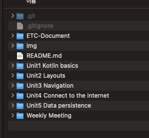
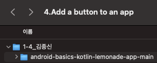
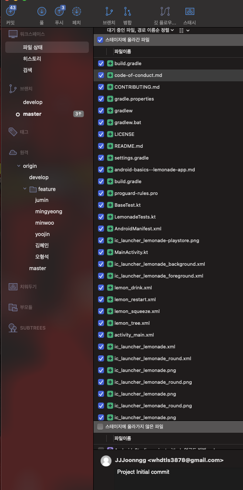
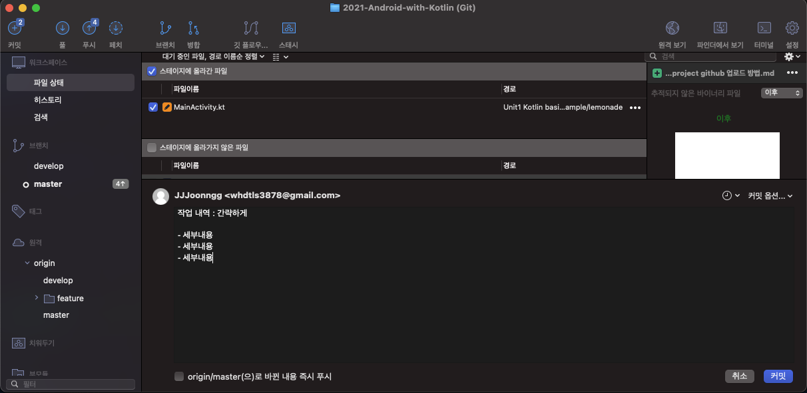

# Android Project Github 업로드 방법

## 1. 제일 먼저 develop 브랜치 에서 pull 을 땡기고 작업브랜치와 develop 브랜치와 merge 를 진행

- 최상위 폴더에서 mac  기준` command + shift + . ` 누르거나, window 기준 숨김파일을 봤을 때
- **.gitignore 파일이 보이는지 확인** -> 없다면 멘토에게 개별 연락

 

 

## 2. 그런 다음 작업 프로젝트를 작업 챕터 폴더에 생성하는데 , 생성 시 Unit_pathway_개인이름(될 수 있으면 영문으로) (숫자로만) 폴더를 생성하고, 

하위 에서 프로젝트를 생성 하도록한다. (**다른 사람과 프로젝트가 겹치지 않게 하기 위해서 하는 규칙!**)

 

 

## 3. 작업 진행 전 프로젝트 생성했을 때 최초 커밋을 나타내는 Proejct Initial Commit 을 해준다 

(이유 : 프로젝트 생성이 잘못 되었을 경우를 추적하기 위해서)

- **여기서 과도하게 파일 갯수가 많다면(100개 이상) 멘토에게 개별 연락! (git ignore 가 적용되지 않은 것)**

 

 

## 4. **작업 진행!** 

- 커밋의 단위는 기능 별 단위로 쪼개서 하는걸 추천(텍스트 뷰 작업 진행! :o: ) (너무 작게 쪼개는건 의미가 없다! - 글자 바꿈! :x: )
- 커밋내용은 최상위 줄에 `작업내용 요약`, 그다음 줄바꿈 이후에 - `세부내용` 을 써주는 형식으로 커밋 (세부내용이 없다면 요약만으로도 충분)
- 이렇게 커밋을 이어나가면서 작업을 진행하면 된다!

 

---

## 
**기타 질문사항이 있거나 궁금한 점이 있다면 언제든지 멘토에게 연락주세요!**

---

