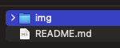
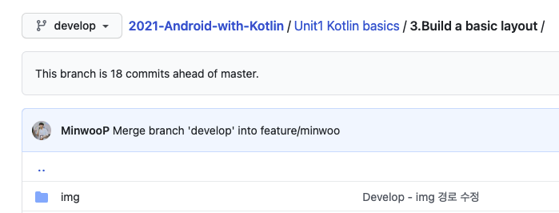
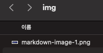
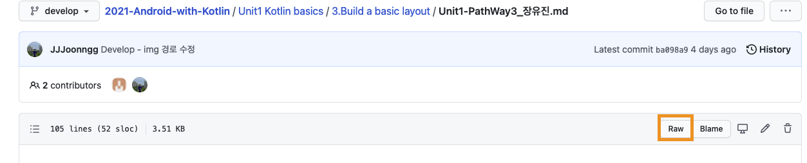
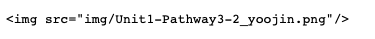
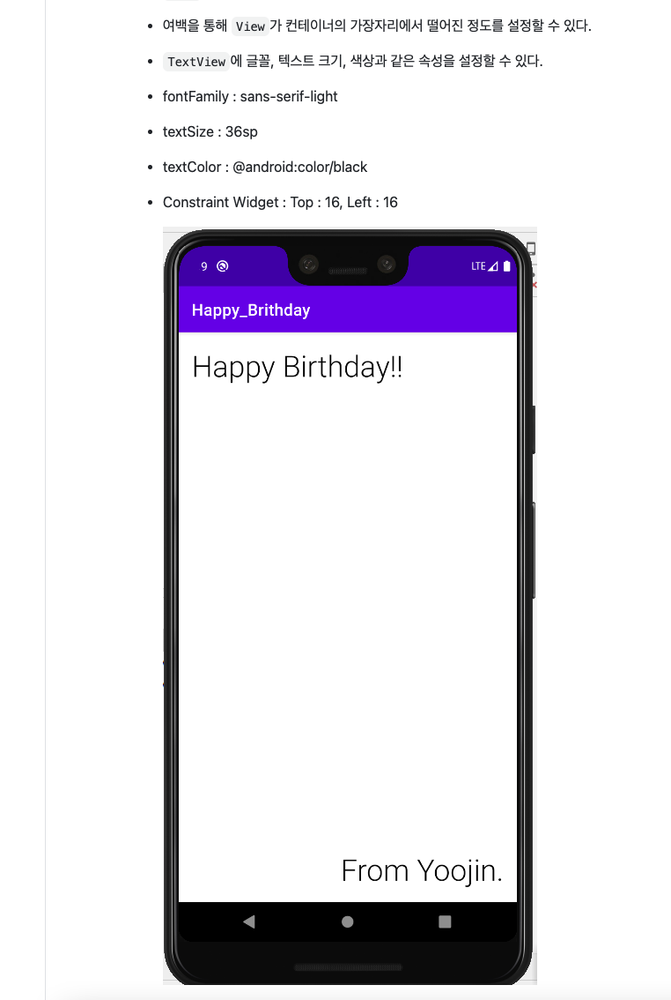

## MarkDown Img 첨부 방법 (원격 저장소에서도 보이게!)

1. **각자의 파일을 올릴 폴더에 새로운 폴더를 생성한다. 이름 - img 로 통일 (이미 존재한다면 생성 X)**




> 경로 상위 폴더에 - 예시 (Unit 1 Kotlin basics/3.Build a basic layout/img/)



<br>

<br>

2. **각 img 의 파일명을 설정 - 개개인의 이름을 끝에 넣어준다. (예시 - `img1_JongSing.png` 끝자리에는 확장자를 넣어줌)** 

> 각 인원들이 동일한 파일 명을 올리게 되면 꼬일 수 있으니 하는 것입니다~!

<br>

<br>

3. **해당 img 파일을 img 폴더 내부에 넣어준다.**



<br>

<br>

4. **` `  태그를 이용하여 mark down 에 해당 이미지를 삽입 한다.**
   - 파일 경로는 img/ 에 있기 때문에 해당 경로를 넣어주면 됩니다.

> 예시코드

```markdown
...


...
```

<br>

<br>

- 결과물 예시 - [2021-Android-with-Kotlin/Unit1 Kotlin basics/3.Build a basic layout/Unit1-PathWay3_장유진.md](https://github.com/LandvibeDev/2021-Android-with-Kotlin/blob/develop/Unit1%20Kotlin%20basics/3.Build%20a%20basic%20layout/Unit1-PathWay3_%EC%9E%A5%EC%9C%A0%EC%A7%84.md)

  

  - 저장소 위치에 들어가서 Raw 버튼을 클릭하면 mark down 파일이 작성 된 것을 raw text로 볼 수 있습니다.

  <br>

  

  - 해당 파일에서 볼 수 있는 `img`  태그!

  

  - 결과물은 원래의 원격 저장소 주소에서 확인!

<br>

#### **추가옵션 `` 태그 내부에 `width` 나 `height` 옵션을 설정하여 이미지 사이즈 조절이 가능**

- 둘중 하나의 옵션만 첨부하면 원본 이미지 비율에 맞게 나머지 속성값도 변경 됩니다.

```markdown


<!--원래의 비율이 깨지게 됩니다.-->

```

<br>

<br>

---

