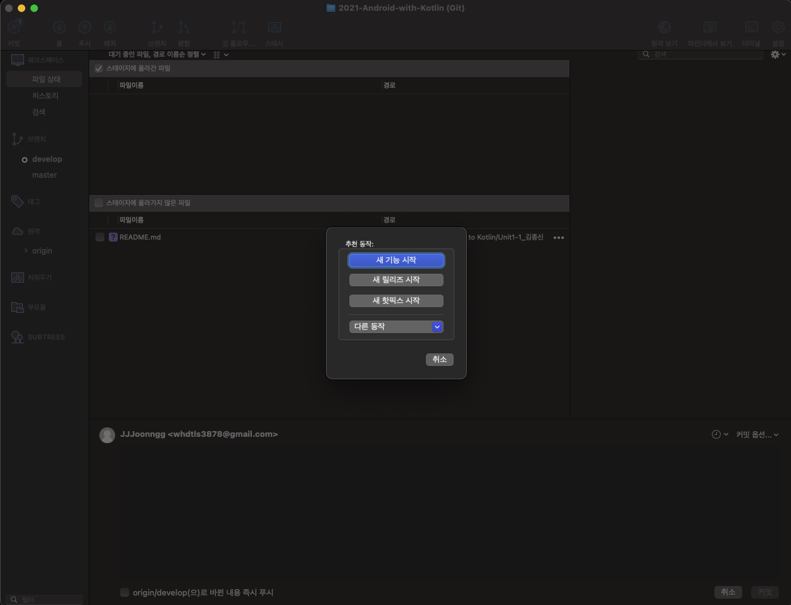
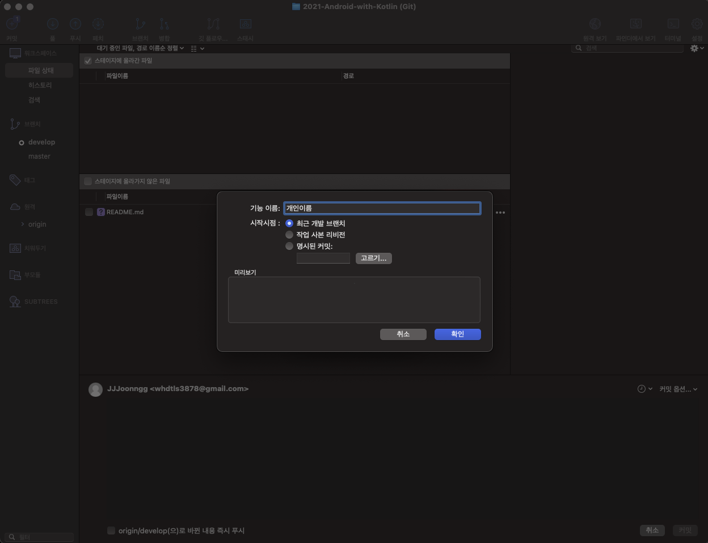
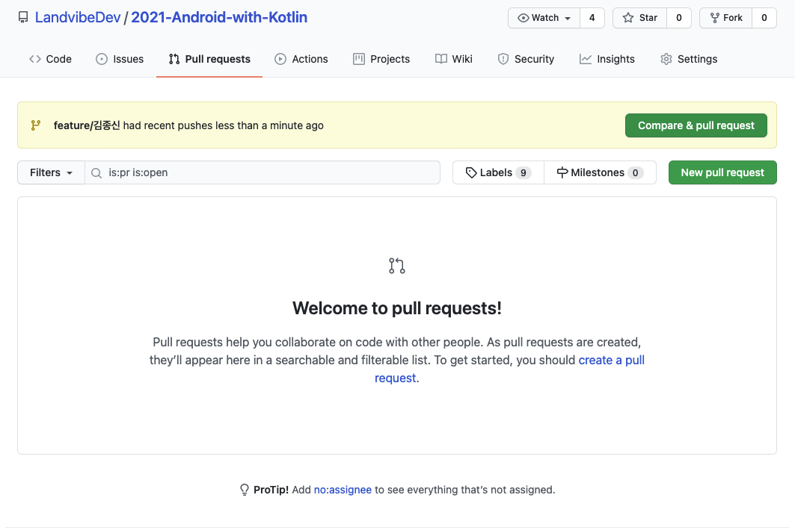
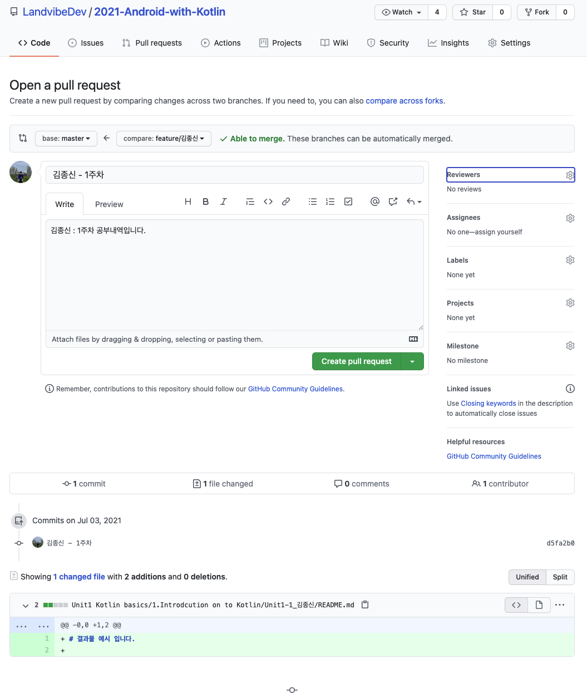
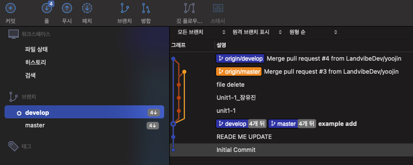

# 2021 Android with Kotlin

## 주제

kotlin 으로 각자의 안드로이드 앱을 만들기 위해서 개인 스터디를 진행

해당 과정을 모두 마친 사람들은 각자의 앱을 만들어서 배포까지 할 수 있도록 한다

## 개인 스터디 방법

https://developer.android.com/courses/android-basics-kotlin/course 의 코스를 진행 해가며 각자의 공부 기록들을

mark down 확장자로 작성하여 해당 Repository 에 PR 을 날리는 형식으로 진행한다.

매주 목요일 오후 8시 까지 그 전까지 개인이 공부한 것들을 정리, 간단하게 발표를 진행하도록한다.

## PR 규칙

각 Unit 내부에 있는 Pathway 들을 마칠 때 마다 주어지는 뱃지를 획득시에 PR 을 보낼 수 있도록 한다.

내용을 너무 상세히 작성 할 필요는 없으나, quiz 와 homework 가 있는 과정에서는 반드시 내용을 포함하여 내용을 작성한다.

또한 실습 내역이 있는 경우 해당 결과물들을 포함하여 올리도록 한다 

각 file 명 맨뒤에는 _개인 이름 을 적어서 pr 날리도록 한다. (다른 사람들과 겹치지 않도록 하기 위함)

PR 예시

경로 : LandvibeDev/2021-Android-with-Kotlin/Unit1 Kotlin basics/1.Introduction on to Kotlin/Unit1-1_개인이름/결과물들

## 결과물

결과물의 대한 규칙은 따로 존재하지 않으며 자유롭게 작성하여 올릴 수 있도록 한다.

## 개인 결과물 PR 날리는 방법 (with source Tree)

**개인 결과물들을 저장하는 방법입니다.**

(mac 기준입니다.)

1. **source 트리 저장소 연동 이후, 상단 탭 우클릭 이후 도구 막대 사용자화 클릭**

****

2. **깃 플로우 기능을 드래그 하여 상단 원하는 위치에 올린뒤 완료**

****

3. **해당 화면이 뜰 경우 확인을 눌러서 저장**

****

4. **개인 작업을 진행 할경우 깃 플로우 버튼을 누르고, 해당 창이 뜨면 새 기능 시작을 눌러서 시작**

****

5. **기능이름 : 개인 이름을 작성하고 확인을 누름**

****

6. **결과물들을 작업하고 커밋**

****

7. **상단의 푸시 버튼을 클릭하여 푸시 브랜치로 부시 (각자 브랜치의 체크박스만 클릭하면 됩니다.) 여기까진 개인 작업 완료**

****

8. **push 까지 완료 되었다면 github 으로 돌아와서 `Pull requests`  탭을 클릭하고 우측에 `New Pull request` 를 클릭**

****

9. **base : develop 으로 지정하고, compare : 는 자신의 이름으로 작성된 branch 로 변경**
   - **Reviewers 는 멘토를 지정 (JJJoonngg 검색)**
   - **Assignees 에는 assign yourself 를 클릭하거나, 자기 자신을 지정**
   - **그 이후에 내용을 작성하고 `Create pull request` 버튼을 누르면 끝**

10. **추후에 작업을 다시 진행 하게 될 경우**

    - **develop 브랜치로 checkout 이후, 패치를 클릭하여 최신화**
    - 원격과 동일하게 맞추기 위해서 **풀을 클릭해서 변경 사항들 받아오고**
    - **기존에 존재하던 작업 브랜치 삭제**! (원격 브랜치는 PR merge 시에 리뷰어가 삭제합니다~!)
    - 추가 작업 진행시에는 **깃플로우를 클릭하여서 진행!** (기존 로직과 동일하게 진행)

    
