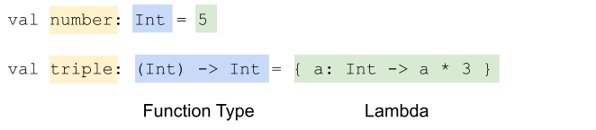

## 2021 Landvibe Summer Coding - Android

### 🔎 Android Basics In Kotlin

#### 📌 Unit3: Navigation

#### 📌 PathWay1: Navigate between screens

<hr>

##### 컬렉션

: 단어 목록이나 직원 기록 모음과 같은 관련 항목 그룹

👉🏻 항목은 순서가 지정되거나 지정되지 않을 수 있으며 고유하거나 고유하지 않을 수 있음

👉🏻 컬렉션의 한 유형: 목록 /목록의 항목에는 순서가 있지만 항목이 고유할 필요X

👉🏻 컬렉션의 한 유형: 집합


##### 집합

: 목록과 달리 중복될 수 없으며 순서는 중요하지 않음

👉🏻 contains(): 함수를 사용하여 특정 항목이 집합에 속하는지 여부 확인


##### 맵

: 특정 키가 부여된 값을 쉽게 찾을 수 있도록 설계된 *키-값 쌍*의 집합

(키는 고유하며 각 키는 정확히 하나의 값에 매핑되지만, 값은 중복될 수 있음

/키는 해당하는 값에 '매핑'됨)

```kotlin
fun main() {
    val peopleAges = mutableMapOf<String, Int>(
        "Fred" to 30,
        "Ann" to 23
    )
    peopleAges.put("Barbara", 42)
    peopleAges["Joe"] = 51
    println(peopleAges)
}
```


👉🏻 forEach(): 모든 항목을 탐색한 후 항목별로 작업을 실행

```kotlin
peopleAges.forEach { print("${it.key} is ${it.value}, ") }
```

👉🏻 map(): 컬렉션의 각 항목에 변환

```kotlin
println(peopleAges.map { "${it.key} is ${it.value}" }.joinToString(", ") )
```

 👉🏻 filter(): 컬렉션에서 표현식을 기반으로 일치하는 항목을 반환

```kotlin
val filteredNames = peopleAges.filter { it.key.length < 4 }
```


##### 람다

: 이름이 없으며 곧바로 표현식으로 사용할 수 있는 함수



👉🏻 특수 식별자 `it` 사용

```kotlin
val triple: (Int) -> Int = { it * 3 }
```


##### 고차함수

: 람다를 다른 함수로 전달하거나 다른 함수에서 함수를 반환하는 것

👉🏻 예시: `map`, `filter`, `forEach` 함수는 모두 매개변수로 함수를 사용!

👉🏻 람다를 `sortedWith()` 메서드에 전달하여 작성할 수 있음!

```kotlin
println(peopleNames.sortedWith { str1: String, str2: String -> str1.length - str2.length })
```


##### 인텐트

: 암시적 인텐트(구체적, 정확하게 알려줌) / 명시적 인텐트(추상적, 파악 필요)

👉🏻 암시적: 특정 작업(링크열기, 이미지 공유)에 상응/시스템이 인텐트 처리 방법을 결정하도록 함

👉🏻 명시적: 앱의 특정 활동으로 이동하는 데 사용

👉🏻 실행

	1. 컨텍스트 참조 가져오기
	2. 명/암시적에 따라 활동or인텐트 유형을 제공하는 `Intent`객체 만들기
	3. `putExtra()` 호출하여 필요한 데이터 전달
	4. `intent`객체를 전달하는 `startActivity()`호출


📌 [ 단어장 - 솔루션코드](https://github.com/google-developer-training/android-basics-kotlin-words-app/tree/activities)


##### 활동 생명주기

: 활동이 처음 초기화될 때부터 마지막으로 소멸되어 시스템에서 메모리를 회수할 때까지 활동이 거쳐 갈 수 있는 여러 상태로 구성됨


👉🏻 `Activity` 클랴스에서 재정의할 수 있는 콜백 메서드 존재: `onCreate()` `onStart()` `onPause()` `onRestart()` `onResume()` `onStop()` `onDestroy()`

1단계: onCreate() 메서드 확인 및 로깅 추가 

2단계: onStart() 메서드 구현 

3단계: 더 많은 로그 구문 추가 

`onCreate()` ->앱 만든다

`onStart()` ->활동을 시작하고 화면에 표시되게 한다

`onResume() `->활동 포거스를 제공 & 사용자가 상호작용할 수 있도록 활동 준비 (다시 시작할 대상이 없어도 시작 시 호출)

👉🏻 수명 주기 사용 사례

1. 활동 열기 및 닫기
2. 활동에서 이동 및 활동으로 다시 이동
3. 부분적으로 활동 숨기기


##### 구성 변경

: 기기 상태가 매우 급격하게 변경되어 시스템이 변경사항을 확인하는 가장 쉬운 방법이 활동을 완전히 종료하고 다시 빌드하는 것일 때 발생

👉🏻 기기 회전 시 데이터 손실

👉🏻 `onSaveInstanceState()`를 사용하여 번들 데이터 저장

👉🏻 `onCreate()`를 사용하여 번들 데이터 복원


##### 퀴즈

1. Which of the following is false about collections and higher order functions in Kotlin?

   > Lists are unordered, while maps and sets are ordered data types.

2. Given the following code, what is the result of `oneWordCities[1]`?

   ```kotlin
   val cities = listOf("Jeddah", "Bengaluru", "Shenzhen", "Abu Dhabi", "Mountain View", "Tripoli", "Bengaluru", "Lima", "Mandalay", "Tripoli")
   val oneWordCities = cities.toSet().toList().filter { !it.contains(" ")}.sorted()
   ```

   > Jeddah

3. 빈 칸 채우기

   > A(n) `extra` is a piece of data passed between activities when launching an intent.

4. If you open an app, and then leave the app using the back button, in which order were the following activity lifecycle methods called?

   ```kotlin
   onCreate(), onStart(), onStop(), onDestroy()
   ```

5. Which activity lifecycle method would be called if a dialog appears onscreen, partially obscuring an activity?

   > `onPause()` because the activity is still displayed, but no longer has focus.

6. Which of the following is true about the lifecycle of a single activity?

   > `onStart()` can be called multiple times, while `onCreate()` can only be called once.

   > `onResume()` is called when the activity gains focus.

7. Which of the following is false about intents?

   > An implicit intent always results in the system asking the user which app to open.

8. An activity contains the following code in `onCreate()`. What will happen when this code is executed, if the `intent` property is `null`?

   ```kotlin
   val message = intent.extras?.getString("message"
   ).toString()
   ```

   > The app will crash because it attempted to access the extras property on a null object.

9. Which of the following tasks can be performed in `onCreate()`?

   > Configuring views, such as setting the layout manager of a recycler view.

   > Getting extras from the intent that launched the activity.

10. In which method should you handle what happens when a button in the app bar is pressed?

    ```kotlin
    onOptionsItemSelected()
    ```

