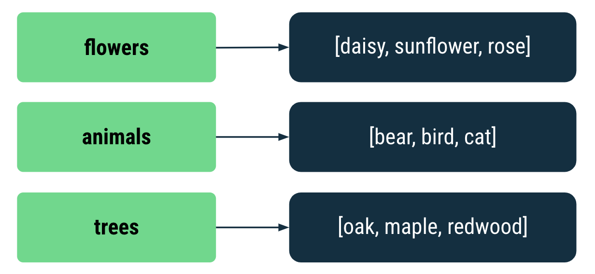
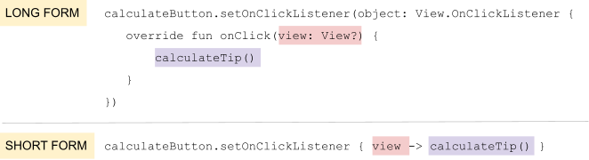
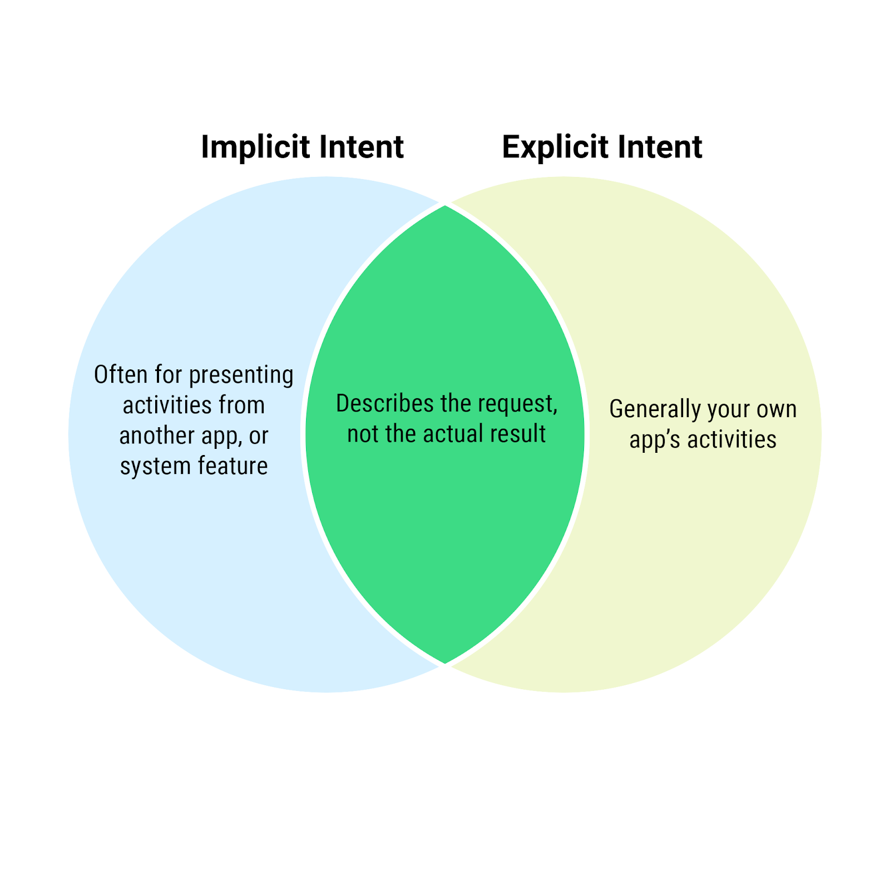
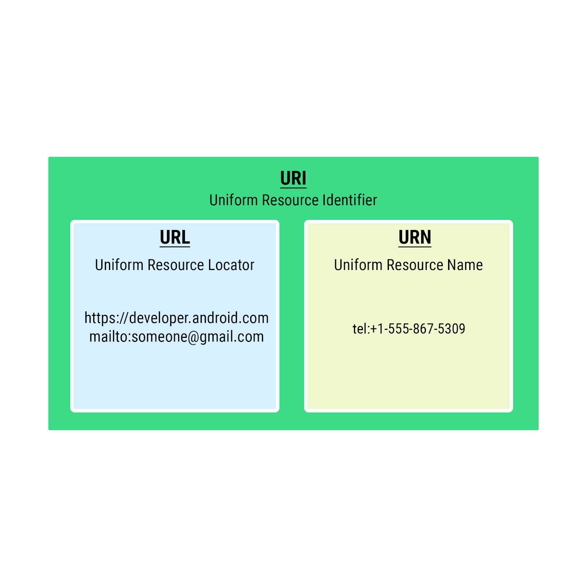

# 2021 Landvibe Summer Coding - Android

## Unit3 : Navigation

### PathWay1 : Navigate between screens


##### :rocket: Collections in Kotlin

- **Collection**

  - 단어 목록이나 직원 기록 모음과 같은 **관련 항목 그룹**
  - 순서 지정 O or 지정 X  **/** 고유 O or 고유 X **/** 변경 O or 변경 X

  ***

  - **List**

    - 목록 (순서 O, 고유 X = 중복 O)  :arrow_forward: `listOf`

    ```kotlin
    fun main() {
        val numbers = listOf(0, 3, 8, 4, 0, 5, 5, 8, 9, 2)
        println("list:   ${numbers}")
        println("sorted: ${numbers.sorted()}")
    }
    ```

    ***

    ``````kotlin
    list:   [0, 3, 8, 4, 0, 5, 5, 8, 9, 2]
    sorted: [0, 0, 2, 3, 4, 5, 5, 8, 8, 9]
    ``````

  ***

  - **Set**

    - 집합 (순서 X, 고유 O = 중복 X) :arrow_forward: `setOf`
      - 변경 불가능 `setOf`
      - 변경 가능    `mutableSetOf`
      - `set`으로 변환 : `toSet()`

    ``````kotlin
    fun main() {
        val numbers = listOf(0, 3, 8, 4, 0, 5, 5, 8, 9, 2)
        println("list:   ${numbers}")
        println("sorted: ${numbers.sorted()}")
        
        val setOfNumbers = numbers.toSet()
        println("set:    ${setOfNumbers}")
        
        val set1 = setOf(1,2,3)
        val set2 = mutableSetOf(3,2,1)
        println("$set1 == $set2: ${set1 == set2}")
        println("contains 7: ${setOfNumbers.contains(7)}")
    }
    ``````

    ***

    ``````kotlin
    list:   [0, 3, 8, 4, 0, 5, 5, 8, 9, 2]
    sorted: [0, 0, 2, 3, 4, 5, 5, 8, 8, 9]
    set:    [0, 3, 8, 4, 5, 9, 2]
    [1, 2, 3] == [3, 2, 1]: true
    contains 7: false
    ``````

    - `contains()` : 특정 항목이 set(집합)에 속하는지 여부 확인 가능
    - `intersect()` : 교집합
    -  `union()` : 합집합

  ***

  - **Map**

    - 특정 키가 부여된 값을 쉽게 찾을 수 있도록 설계된 *키-값 쌍*의 집합 :arrow_forward: `mapOf`

      - **키는 고유**하지만 **값은 중복**될 수 있다.

      

    - 값(value) : 숫자, 객체, collection(list, set, ..)

    - 데이터 쌍이 있는 경우 유용하며, 키를 기반으로 식별 가능하다.

      - `put()` : 항목 추가 **/** `변수[key] = value`  : 약식 표기법 항목 추가 or 업데이트

    ``````kotlin
    fun main(){
        val peopleAges = mutableMapOf<String, Int>(
        	"Fred" to 30,
            "Ann" to 23
        )
        peopleAges.put("Barbara", 42)
        peopleAges["Joe"] = 51
        peopleAges["Fred"] = 31
        println(peopleAges)
    }
    ``````

    ***

    ``````kotlin
    {Fred=31, Ann=23, Barbara=42, Joe=51}
    ``````

  ***

  - **forEach()**

    - 자동으로 모든 항목을 탐색한 후 항목별로 작업을 실행한다.

    `````` kotlin
    peopleAges.forEach { print("${it.key} is ${it.value}, ") }
    ``````

    ***

    ``````kotlin
    Fred is 31, Ann is 23, Barbara is 42, Joe is 51,
    ``````

    - `it` : `forEach`는 변수 지정 대신 특수식별자  `it`을 사용한다
    - 호출 시 `()`를 추가할 필요 없다. `{}`에 코드를 전달하기만 하면 된다.

  ***

  - **map()**

    - 컬렉션의 각 항목에 변환을 적용 :arrow_forward: 변환된 항목으로 이루어진 새 컬렉션 만듦

    `````kotlin
    println(peopleAges.map { "${it.key} is ${it.value}" }.joinToString(", ") )
    `````

    ***

    ``````kotlin
    Fred is 31, Ann is 23, Barbara is 42, Joe is 51
    ``````

    - `joinToString(", ")` : 변환된 컬렉션의 각 항목을 문자열에 추가하고  ` ,`로 구분
    - `{}`안에 각 항목에 적용할 변환을 정의한다.

  ***

  - **filter()**

    - 컬렉션에서 표현식을 기반으로 일치하는 항목을 반환한다.

    `````kotlin
    val filterNames = peopleAges.filter {it.key.length < 4}
    println(filterNames)
    `````

    ***

    ```````kotlin
    {Ann=23, Joe=51}
    ```````

    - 맵에 필터를 적용할 때 반환되는 유형은 `LinkedHashMap`(새 맵)이다.
    - 호출 시 `()`를 추가할 필요 없다. `{}`에 코드를 전달하기만 하면 된다.

  ***

  - **람다(표현식)**

    - 함수 이름이 없으며 곧바로 표현식으로 사용할 수 있는 함수

    - **함수 유형**

      - 입력 매개변수와 반환 값을 기반으로 특정 유형의 함수를 정의할 수 있다.
      - ex) `(Int) -> Int` : `Int`유형의 배개변수 사용, `Int` 유형 값 반환

      

      ​     매개변수		함수본문

      - 변수에 람다 저장 (변수이름, 변수유형, 변수 값)

      

      ``````kotlin
      fun main(){
          val triple: (Int)->Int = {a: Int -> a*3}
          println(triple(5))
      }
      ``````

      ***

      ``````kotlin
      15
      ``````

      :key: 단일 매개변수가 있는 람다의 매개변수에 특수 식별자 `it`을 사용할 수 있다

      ``````kotlin
      val triple: (Int)->Int = { it*3 }
      ``````

  ***

  - **고차 함수**

    - 함수(ex) 람다)를 다른 함수로 전달하거나 다른 함수에서 함수를 반환하는 것

      - `map`, `filter`, `forEach` : 매개변수를 함수로 사용했으므로 고차함수이다

      ``````kotlin
      peopleAges.filter{ it.key.lenght < 3 }
      ``````

      :key: 고차함수에 전달되는 람다에서는 단일 매개변수와 화살표 생략하고 `it` 사용 가능

    - `sortedWith()`

      ``````kotlin
      fun main(){
          val peopleNames = listOf("Fred", "Ann", "Barbara", "Joe")
          println(peopleNames.sorted())
          println(peopleNames.sortedWith{ str1: String, str2: String -> str1.lenght - str2.lenght })
      }
      ``````

      - 첫 번째 객체 < 두 번째 객체 :arrow_forward: 0보다 작은 값
      - 첫 번째 객체 > 두 번째 객체 :arrow_forward: 0보다 큰 값

  ***

  - **Android의 OnClickListener 및 OnKeyListener**

    - `setOnClickListener`

    

    `view` 매개변수가 사용되지 않으므로 `view`를 생략가능

    ``````kotlin
    calculateButton.setOnClickListener{ calculateTip() }
    ``````

    - `setOnKeyListener`

    ``````kotlin
    costOfServiceEditText.setOnKeyListener { view, keyCode, event -> handleKeyEvent(view, keyCode) }
    ``````

    :key: 함수에서 람다매개변수 사용하지 않는 경우 이름을 _로 지정할 수 있다.

    ``````kotlin
    costOfServiceEditText.setOnKeyListener { view, keyCode, _ -> handleKeyEvent(view, keyCode) }
    ``````

  ***

  - **단어 목록 만들기**

    - **단어 컬렉션**

    ``````kotlin
    fun main(){
        val words = listOf("about", "acute", "awesome", "balloon", "best", "brief", "class", "coffee", "creative")
    }
    ``````

    - `filter`
      - `startsWith()` : 지정된 문자열로 시작하는 경우 true반환
      - `ignoreCase` : 대소문자 구분 :arrow_forward: `true` : 대소문자 구분 하지 않는다
      - `shuffled()` : 항목이 무작위로 섞이게 할 수 있다.
      - `take()` : 몇 가지만 가져오도록 한다.
      - `sorted()` : 정렬

    ``````kotlin
    val filteredWords = words.filter{ ii.startsWith("b", ignoreCase = true) }
    	.shuffled()
    	.take(2)
    	.sorted()
    println(filteredWords)
    ``````

    ***

    ``````kotlin
    [balloon, brief]
    ``````

    

    

##### :rocket: Activites and intents

- **intent**

  - 실행할 작업을 나타내는 객체

    - **명시적** 인텐트

      *앱의 특정 활동으로 이동하는 데 사용*

      - 매우 구체적, 실행할 활동을 정확하게 할 수 있고 자체 앱의 화면인 경우가 많다.
      - 자체 앱에서 작업 또는 화면 표시에 사용하며 전체 프로세스를 책임진다.

    - **암시적** 인텐트

      *특정 작업에 상응, 시스템이 인텐트 처리 방법을 결정하도록 한다*

      - 추상적, 시스템에 링크 열기 or 이메일 작성 or 전화 걸기 or 이미지 공유와 같은 작업 유형을 알려준다.
      - 다른 앱이 관련된 사업을 실행하는 데 사용하고 시스템이 최종 결과를 결정한다.

    

  ***

  - 명시적 인텐트 설정

    :arrow_forward:  mainactivty의 recyclerview의 adapter

    :arrow_forward: 누른 버튼의 text를 detailactivity로 전달하며 activty 이동

    ``````kotlin
    override fun onBindViewHolder(holder: LetterViewHolder, position: Int) {
            val item = list.get(position)
            holder.button.text = item.toString()
    
            holder.button.setOnClickListener{
                // context 참조를 가져온다
                val context = holder.view.context
                // intent를 만들어 context와 activity 클래스 명을 전달
                // 두번째 인수는 호출할 activity 클래스 이다.
                val intent = Intent(context, DetailActivity::class.java)
                // button의 text를 전달한다.
                intent.putExtra("letter", holder.button.text.toString())
                //activity 이동, intent객체를 전달한다
                context.startActivity(intent)
            }
    }
    ``````

    - `putExtra`
      - activity로 어떤 값(필요한 값)을 넘기기 위해 호출 (key, value)
      - `toString()` : 버튼의 text는 `CharSequence`(인터페이스)이므로 `String`으로 만들어준다.

    :arrow_forward: 전환된 activity

    ```````kotlin
    val letterId = intent?.extras?.getString("letter").toString()
    ```````

    - `extras` 속성 : `Bundle`(map형태의 데이터 묶음)
    - `intent`와 `extras`는 `null`을 허용하므로 `?`를 입력한다.
      - `intent`가 `null` -> `extras` 엑세스 시도x
      - `extras`가 `null` -> `getString()` 호출 시도x
    - `getString`이 `String?`를 반환하므로 `toString()`을 호출하여 `null`인지 확인한다.

  ***

  - `companion object`

    - 특정 인스턴스 없이 상수를 구분하여 사용할 수 있다
    - 재사용 가능한 상수를 'type의 instance'가 아닌 'type'과 연결하는 방법 제공
      - `extra`가 많은 경우 여러 클래스에서 사용할 수 있는 상수 정의
    
    ``````kotlin
    companion object{
        const val LETTER = "letter"
    }
    ``````
    
    ***
    
    ``````kotlin
    val letterId = intent?.extras?.getString(LETTER).toString()
    ``````
    
    ***
    
    ``````kotlin
    intent.putExtra(DetailActivity.LETTER, holder.button.text.toStrig())
    ``````

  ***

  - 암시적 인텐트 설정

    1. url 상수 설정

    ``````kotlin
    companion object {
       val LETTER = "letter"
       val SEARCH_PREFIX = "https://www.google.com/search?q="
    }
    ``````

    2. `SEARCH_PREFIX`에 검색어 문자열을 추가하여 `URI`를 만든다

       ``````kotlin
       holder.button.setOnClickListener {
           val queryUrl: Uri = Uri.parse("${DetailActivity.SEARCH_PREFIX}${item}")
       }
       ``````

       - `URI` : `URL`과 `URN`을 나타내는 데 사용되는 데이터 유형

       

       3. `intent`객체 초기화 후 `intent`를 전달한다.
          - `URI`와 `Intent.`를 전달한다.

       ``````kotlin
       val intent = Intent(Intent.ACTION_VIEW, queryUrl)
       context.startActivity(intent)
       ``````

       - `ACTION_VIEW` - URI를 사용하는 일반적인 인텐트
       - `CATEGORY_APP_MAPS` - 지도 앱을 실행
       - `CATEGORY_APP_EMAIL` - 이메일 앱을 실행
       - `CATEGORY_APP_GALLERY` - 갤러리(사진) 앱을 실행
       - `ACTION_SET_ALARM` - 백그라운드에서 알람 설정
       - `ACTION_DIAL` - 전화를 건다

  ***

  - 메뉴 옵션 추가 (레이아웃 전환)

    - 앱 바 (앱 화면 상단의 바) - `xml`

      ```````kotlin
      <menu xmlns:android="http://schemas.android.com/apk/res/android"
         xmlns:app="http://schemas.android.com/apk/res-auto">
         <item android:id="@+id/action_switch_layout"
             android:title="@string/action_switch_layout"
             android:icon="@drawable/ic_linear_layout"
             app:showAsAction="always" />
      </menu>
      ```````

      - `id`: 뷰와 마찬가지로 메뉴 옵션에는 코드에서 참조할 수 있도록 ID가 있습니다.
      - `title`: 이 텍스트는 실제로 이 경우에 표시되지 않지만 스크린 리더에서 메뉴를 식별하는 데 유용할 수 있습니다.
      - `icon`: 기본값은 `ic_linear_layout`입니다. 그러나 버튼이 선택될 때 그리드 아이콘을 표시하기 위해 사용 설정되거나 사용 중지됩니다.
      - `showAsAction`: 시스템에 버튼 표시 방법을 알려줍니다. 항상으로 설정되어 있으므로 이 버튼은 앱 바에 항상 표시되고 더보기 메뉴에 속하지 않습니다.

    ****

    - 메뉴 버튼 작동 - `kt`

      ``````kotlin
      private var isLinearLayoutManager = true
      ``````

      1. `chooseLayout()` : `layoutManager`설정

      ``````kotlin
      private fun chooseLayout() {
          if (isLinearLayoutManager) {
              // 일렬로 아이템 뷰 배치
              recyclerView.layoutManager = LinearLayoutManager(this)
          } else {
              //격자 형태로 아이템 뷰 배치
              recyclerView.layoutManager = GridLayoutManager(this, 4)
          }
          //adapter 할당
          recyclerView.adapter = LetterAdapter()
      }
      ``````

      ***

      2. `setIcon` : 아이콘 업데이트

      ```````kotlin
      private fun setIcon(menuItem: MenuItem?) {
         if (menuItem == null)
             return
      
         // if (isLinearLayoutManager)
         //     menu.icon = ContextCompat.getDrawable(this, R.drawable.ic_grid_layout)
         // else menu.icon = ContextCompat.getDrawable(this, R.drawable.ic_linear_layout)
         menuItem.icon =
             if (isLinearLayoutManager)
                 ContextCompat.getDrawable(this, R.drawable.ic_grid_layout)
             else ContextCompat.getDrawable(this, R.drawable.ic_linear_layout)
      }
      ```````

      - `contextCompat` : 내부적으로 SDK의 버전을 처리해둔 클래스(SDK버전 상관 없이 값을 가져오기 등을 할 수 있다)

      ***

      3. `onCreateOptionMenu` : 레이아웃 확장 후 `setIcon`호출
         - 옵션 메뉴를 확장하여 추가 설정을 실행

      ``````kotlin
      override fun onCreateOptionsMenu(menu: Menu?): Boolean {
         //인플레이션
         menuInflater.inflate(R.menu.layout_menu, menu)
      
         val layoutButton = menu?.findItem(R.id.action_switch_layout)
         //layoutButton(MenuItem)의 icon설정
         setIcon(layoutButton)
      
         return true
      }
      ``````

      - **인플레이션** (`inflate`) : XML레이아웃 파일안의 뷰 태그들을, 뷰 객체화 하여 메모리에 로딩하여 화면(뷰그룹)에 보일 수 있도록 해주는 과정

        - 해당 xml에 배치한 UI 요소를 끌어와 사용할 수 있게 된다.

          ex) `menu?.findItem(R.id.action_switch_layout)`

        - 매개변수

          1. 객체화 하고픈 xml 파일
          2. 객체화한 뷰를 넣을 부모 레이아웃/컨테이너
          3. true : 바로 붙이기

      ***

      4. `onOptionsItemSelected` : 항목에 따라 적절히 UI 업데이트
         - 버튼이 선택될 때 실제로 `chooseLayout()`을 호출

      ```````kotlin
      override fun onOptionsItemSelected(item: MenuItem): Boolean {
         return when (item.itemId) {
             // 선택된 item이 action_switch_layout라면
             R.id.action_switch_layout -> {
                 // 메뉴가 탭되었다면 isLinearLayoutManager값을 반전시킨다.
                 isLinearLayoutManager = !isLinearLayoutManager
                 // layout설정
                 chooseLayout()
                 //icon설정
                 setIcon(item)
      
                 return true
             }
             else -> super.onOptionsItemSelected(item)
         }
      }
      ```````

      ***

      5. `onCreate`

      ```````kotlin
      override fun onCreate(savedInstanceState: Bundle?) {
         super.onCreate(savedInstanceState)
      
         val binding = ActivityMainBinding.inflate(layoutInflater)
         setContentView(binding.root)
      
         recyclerView = binding.recyclerView
         // Sets the LinearLayoutManager of the recyclerview
         chooseLayout()
      }
      ```````

    


##### :rocket: Stages of the activity lifecycle

- **acticty lifecycle**

  - 전체 기간 중 일련의 activity 상태 (activity 생성 ~ activity 소멸)
    - activity 상태 변경 :arrow_forward: activity간 이동, app 안팎 이동

  - 수명 주기 상태 & **콜백**

    - **표시 수명 주기** : 백그라운드 -> 포그라운드
    - **대화형 수명 주기** : 앱이 완전히 화면에 표시되고 사용자 포커스를 보유하는 수명 주기 부분

    

    - **콜백 메서드 (callback)**

      다른 함수에서 인수로 전달되는 함수, 일종의 이벤트 후에 실행 될 것으로 예상

      - 목적 : 다른 클래스에서 일부 작업이 완료된 경우 클래스 Sync/Async에 알리는 것 (비동기 작업 시 유용)

      - **피호출자가 호출자를 부른다**

        :x: 사용자 :arrow_forward: 시스템(임의의 서비스)

        :o: **시스템 측에서 이벤트를 발생**시켜 처리를 해달라고 요청해오는 과정에서 콜백

      - 수명주기 콜백 메서드

        - `onCreate()` -> `super.onCreate()` 즉시 호출

          : 슈퍼클래스 구현을 호출하여 활동 생성을 완료해야 한다.

      ***

      1. **onCreate()**

         : 앱을 만든다

         - activity의 일회성 초기화 실행

         - 실행되면 activity가 *생성됨*으로 간주된다.
         - 활동이 초기화 된 직후 **한 번** 호출된다

         ```````kotlin
         // const -> 컴파일 시강 상수 (변경되지 않는 값)
         const val TAG = "MainActivity"
         
         override fun onCreate(savedInstanceState: Bundle?) {
                 super.onCreate(savedInstanceState)
                 Log.d(TAG, "onCreated Called")
             }
         ```````

         - **Log** : Logcat(메시지를 기록하는 콘솔)에 메시지를 쓴다, 클래스

           :arrow_forward: 날짜 및 시간, 패키지 이름, 로그 태그, 실제 메시지

           - 로그 메시지 우선순위
             - `Log.d()` : 디버그 메시지 작성 -> 검색 시 `D/` 시작부분에 추가
             - `Log.i()` : 정보 메시지 작성
             - `Log.e()` : 오류 메시지
             - `Log.w()`: 경고 메시지
             - `Log.v()` : 더 자세한 메시지

           - 로그 태그 (첫 번째 매개변수)

             : Logcat에서 로그 메시지를 더 쉽게 찾을 수 있는 문자열 (보통 클래스이름)

           - 로그 메시지 (두 번째 매개변수)

      ***

      2. **onStart()**

         : 활동을 시작하고 화면에 표시되게 한다.

         - `onCreate()`직후 호출된다.
         - 실행되면 activity가 화면에 표시된다.
         - activity의 수명 주기에서 *여러 번* 호출 될 수 있다.
         - `onStop()` 메서드와 페어링 (기기 홈 화면으로 돌아오면 stop, 화면에 표시되지 않는다.)

         ```````kotlin
         override fun onStart() {
            super.onStart()
            Log.d(TAG, "onStart Called")
         }
         ```````

      ***

      3. **그 외**

         - **onResume()**

           : activity 포커스를 제공하고 사용자가 상호작용할 수 있도록 활동을 준비

           - 사용자가 앱과 상호작용 가능
           - 포커스가 있을 때 호출된다

         - **onPause()**

           : 앱에 포커스가 없다

         - **onStop()**

           : 앱이 화면에 표시되지 않는다.

         - **onDestroy()**

           - acitivity 완전히 종료, 가비지 컬렉션(더 이상 사용하지 않을 객체의 자동 정리)될 수 있음을 의미

           - 시스템은 이러한 리소스가 삭제될 수 있음을 인식하고 메모리 정리를 시작한다.

           - 한 번 호출된다.

           - `finish()`를 호출 or 사용자가 앱 강제 종료 하는 경우에도 종료될 수 있다.

             ex) Android 시스템은 앱이 오랫동안 화면에 표시되지 않으면 자체적으로 활동을 종료할 수도 있다.

         - **onRestart()**

           : activity가 처음으로 시작되지 **않은** 경우에만 호출하려는 코드를 배치하는 위치

           - activity가 표시되기 전에 호출

         ``````kotlin
         override fun onResume() {
            super.onResume()
            Log.d(TAG, "onResume Called")
         }
         
         override fun onPause() {
            super.onPause()
            Log.d(TAG, "onPause Called")
         }
         
         override fun onStop() {
            super.onStop()
            Log.d(TAG, "onStop Called")
         }
         
         override fun onDestroy() {
            super.onDestroy()
            Log.d(TAG, "onDestroy Called")
         }
         
         override fun onRestart() {
            super.onRestart()
            Log.d(TAG, "onRestart Called")
         }
         ``````

      ***

      - **activity 열기 및 닫기**
        - 활동이 처음 시작되면 `onCreate()`, `onStart()`, `onResume()` 콜백이 호출
        - 뒤로 버튼을 탭하면 `onPause()`, `onStop()`, `onDestroy()`가 순서대로 호출
      - **개요 화면에서 해당 앱 들어가기 (최근 화면 또는 최근 앱)**
        - Android는 새 활동을 시작하고 `onCreate()`, `onStart()`, `onResume()` 메서드를 호출
      - **activity에서 이동 및 activity로 다시 이동**
        - 앱 완전 종료 (소멸) :x: 
        - 백그라운드 전환 : `onPause()` 메서드와 `onStop()` 메서드가 호출
        - 포그라운드 전환 : `onRestart()`와 `onStart()`로 다시 시작된 후 `onResume()`으로 재개
      - **부분적으로 활동 숨기기**
        - 가시성은 있지만(부분적 표시) *포커스*는 없을 수 있다.
        - `onPause()`만 호출 -> (공유 대화상자 외부 클릭, 앱으로 돌아감) -> `onResume()`이 호출

      ***

      - **구성 변경**

        : 기기 상태가 매우 급격하게 변경되어 시스템이 변경사항을 확인하는 가장 쉬운 방법이 **활동을 완전히 종료하고 다시 빌드하는 것일 때 발생**
        - **기기 회전**

          - 모든 수명 주기 콜백을 호출하여 activity**종료**
          - 다음 activity가 다시 만들어질 때 까지 모든 수명 주기 콜백을 호출하여 홀동 시작
          
          :arrow_forward: **번들 데이터 저장**
          
          - `onSaveInstanceState()`
            - Activity가 소멸되면 필요할 수 있는 데이터를 저장하는 데 사용하는 콜백
            - Activity가 중지 된 후 호출
            - 백그라운드로 전환될 때마다 호출
          
          ``````kotlin
          override fun onSaveInstanceState(outState: Bundle) {
              super.onSaveInstanceState(outState)
              Log.d(TAG, "onSaveInstanceState Called")
             
              outState.putInt(KEY_REVENUE, revenue)//수익
              outState.putInt(KEY_DESSERT_SOLD, dessertsSold)//판매수
          }
          ``````
          
          - **번들**
          
            - key-value의 쌍, key는 문자열이다.
          
            - 메모리에 유지되므로 데이를 작게 유지하는 것이 좋다
          
            - `putInt()`,`putFloat()`,`putString()` : `Bundle`클래스 method
          
              -> 두 가지 인수를 사용 (key, value)
          
          :arrow_forward: **번들 데이터 복원**
          
          - `onCreate(Bundle)` or `onRestoreInstanceState(Bundle)`에서 복원 가능
          
          ``````kotlin
          override fun onCreate(savedInstanceState: Bundle?) {
              super.onCreate(savedInstanceState)
              Log.d(TAG, "onCreated Called")
              
              //bundle이 null이 아니라면 종료 후 다시 만들어진 것
              if (savedInstanceState != null) {
                  //(key, 기본값(값이 없는 경우))
                  revenue = savedInstanceState.getInt(KEY_REVENUE, 0)
                  dessertsSold = savedInstanceState.getInt(KEY_DESSERT_SOLD, 0)
                  
                  showCurrentDessert()
              }
          
              binding.revenue = revenue
              binding.amountSold = dessertsSold        
          }
          ``````
      
      
      
      

##### :rocket: Quiz

1. Which of the following is false about collections and higher order functions in Kotlin?

   - Lists are unordered, while maps and sets are ordered data types.

   

2. Given the following code, what is the result of `oneWordCities[1]`?

   ``````kotlin
   val cities = listOf("Jeddah", "Bengaluru", "Shenzhen", "Abu Dhabi", "Mountain View", "Tripoli", "Bengaluru", "Lima", "Mandalay", "Tripoli")
   val oneWordCities = cities.toSet().toList().filter { !it.contains(" ")}.sorted()
   ``````

   - Jeddah

   

3. 빈 칸 채우기

   *단어를 하나 이상 입력하여 문장을 완성하세요.*

   A(n) `extra `is a piece of data passed between activities when launching an intent.


4. If you open an app, and then leave the app using the back button, in which order were the following activity lifecycle methods called?
   - `onCreate(), onStart(), onStop(), onDestroy()`


5. Which activity lifecycle method would be called if a dialog appears onscreen, partially obscuring an activity?
   - `onPause()` because the activity is still displayed, but no longer has focus.


6. Which of the following is true about the lifecycle of a single activity?

   *적절한 답변을 모두 선택합니다.*

   - `onStart()` can be called multiple times, while `onCreate()` can only be called once.
   - `onResume()` is called when the activity gains focus.


7. Which of the following is false about intents?
   - An implicit intent always results in the system asking the user which app to open.


8. An activity contains the following code in `onCreate()`. What will happen when this code is executed, if the `intent` property is `null`?
   - The app will crash because it attempted to access the extras property on a null object.


9. Which of the following tasks can be performed in `onCreate()`?

   *적절한 답변을 모두 선택합니다.*

   - Configuring views, such as setting the layout manager of a recycler view.
   - Getting extras from the intent that launched the activity.


10. In which method should you handle what happens when a button in the app bar is pressed?
    - `onOptionsItemSelected()`
