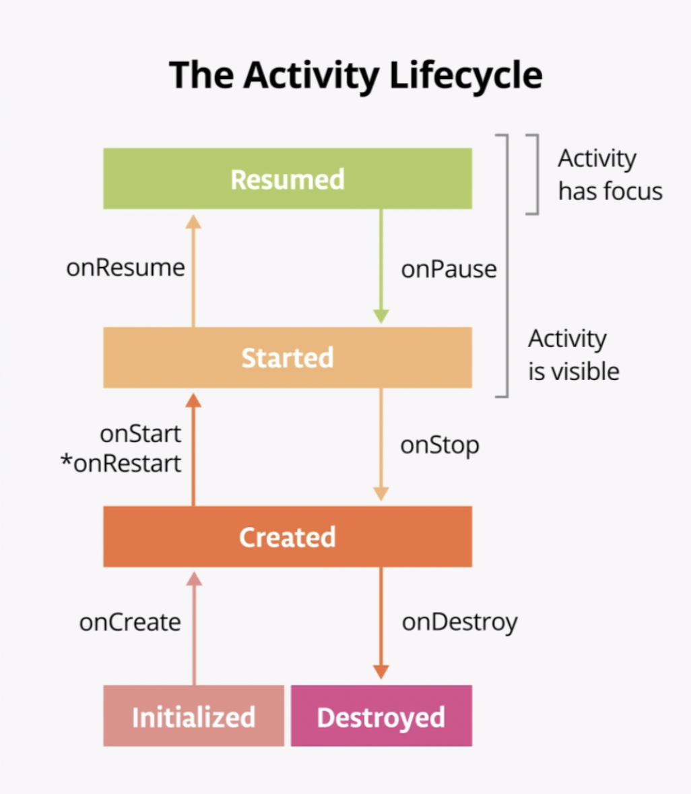

# 💡 Android Basics in Kotlin

## Unit #3 : Navigation

## PATHWAY #1 : Navigate between screens

<br/>

## 👩🏻‍💻 Kotlin의 컬렉션

#### 👉 컬렉션 종류

- **목록** : 중복 가능

- **집합** : 중복 불가능

  - 목록 -> 집합 변경 

    ```kotlin
    val setOfNumbers = numbers.toSet()
    ```

  - 특정 항목 확인

    ```kotlin
    println("contains 7: ${setOfNumbers.contains(7)}")
    ```

  - `intersect()` : 교집합

  - `union()` : 합집합

- **맵** : 키-값 쌍의 집합으로, 각 키는 정확히 하나의 값에 매핑되지만, 값은 중복 가능

  - 생성

    ```kotlin
    fun main() {
        val peopleAges = mutableMapOf<String, Int>(
            "Fred" to 30,
            "Ann" to 23
        )
    }
    ```

  - 추가 : `put()` 또는 약식 표기법 사용

    ```kotlin
    peopleAges.put("Barbara",42)
    peopleAges["Joe"] = 51
    ```

<br/>

#### 👉 컬렉션 사용

- `forEach()` : 열거함수. 특수 식별자 it사용

  ```kotlin
  peopleAges.forEach { print("${it.key} is ${it.value}, ") }
  ```

- `map()` : 변환적용함수. 각 항목에 변환 적용하고 변환된 항목으로 이루어진 새 컬렉션 만듬. `joinToString`과 점연산자`.`로 결합

  ```kotlin
  println(peopleAges.map { "${it.key} is ${it.value}" }.joinToString(", ") )
  ```

- `filter()` : 일치항목 반환함수.

  ```kotlin
  val filteredNames = peopleAges.filter { it.key.length < 4 }
  println(filteredNames)
  ```

<br/>

#### 👉 람다

- 람다 : 이름이 없으며 곧바로 표현식으로 사용할 수 있는 함수.  `{ }` 사용

- 함수 유형 : (자료형1) -> 자료형2 :  자료형1인 매개변수를 사용하고 자료형2인 값을 반환한다.

  ```kotlin
  val triple: (Int) -> Int = { a: Int -> a * 3 }	
  val triple: (Int) -> Int = { it * 3 }
  ```

- 함수 본문에서 특정 람다 매개변수를 사용하지 않는 경우 이름을 `_`로 지정

  ```kotlin
  costOfServiceEditText.setOnKeyListener { view, keyCode, _ -> handleKeyEvent(view, keyCode) }
  ```

<br/>

#### 👉 고차 함수

- 고차함수 : 함수를 다른 함수로 전달하거나 다른 함수에서 함수를 반환하는 것.

- `map()` `filter()` `forEach()`

- `sortedWith()` : 이름 길이를 기준으로 오름차순으로 목록 출력

  ```kotlin
  fun main() {
      val peopleNames = listOf("Fred", "Ann", "Barbara", "Joe")
      println(peopleNames.sortedWith { str1: String, str2: String -> str1.length - str2.length })
  }
  
  // [Ann, Joe, Fred, Barbara]
  ```

<br/>

#### 👉 단어 목록 만들기

- `filter` ,  `startsWith()` : 지정된 문자열로 시작하는 문자열 찾기

- `shuffled()` : 무작위로 섞기

- `take()` : 컬렉션의 앞 항목 가져오기

  ```kotlin
  fun main() {
      val words = listOf("about", "acute", "awesome", "balloon", "best", "brief", "class", "coffee", "creative")
      val filteredWords = words.filter { it.startsWith("b", ignoreCase = true) }
    	.shuffled()
    	.take(2)  //괄호안의 숫자 -> 반환할 단어 개수
    	.sorted()
  		println(filteredWords)
    
  }
  ```

<br/>

<br/>

## 👩🏻‍💻 인텐트

#### 👉 인텐트

- 실행할 작업을 나타내는 객체
  - **암시적 인텐트** : 매우 구체적, , 앱의 특정 활동으로 이동하는 데 사용된다. 실행할 활동을 정확하게 알 수 있고 자체 앱의 화면인 경우가 많다.
  - **명시적 인텐트** : 좀 더 추상적,  특정활동(ex. 링크 열기, 이미지 공유, 이메일 작성, 전화 걸기) 같은 작업 유형을 알려주고 시스템이 인텐트 처리 방법을 결정하도록 한다.

<br/>

#### 👉 Words 앱 명시적 인텐트 설정

- `LetterAdapter.kt` 의 `onBindViewHolder()` 에 추가

  ```kotlin
  holder.button.setOnClickListener {
    //1. 컨텍스트 참조 가져오기
    val context = holder.view.context 
    //2. Intent 객체를 만들어 컨텍스트와 대상 활동의 클래스 이름 전달,
    //표시하려는 활동의 이름은 DetailActivity::class.java로 지정.
    val intent = Intent(context, DetailActivity::class.java)
    //3. putExtra() 호출하여 문자를 첫 번째 인수로 전달, 버튼 텍스트를 두번째 인수로 전달
    intent.putExtra("letter", holder.button.text.toString())
    //4. 컨텍스트 객체에서 startActivity() 메서드를 호출하여 intent를 전달
    context.startActivity(intent)
   }
  ```
  
- DetailActivity 설정

  - `DetailActivity` 의 `onCreate` 에 추가

    ```kotlin
    val letterId = intent?.extras?.getString("letter").toString()
    ```

    - ⁉️ **물음표** 붙이는 이유는? : `intent` 및 `extras` 속성은 null을 허용하므로 값이 있을 수도 있고 없을 수도 있기 때문에 이 값에 안전하게 액세스 하기위해 이름 뒤에 `?`를 입력한다.

       문제 : 객체가 있거나 `null`일 수 있는데, 그냥 앱이 속성에 액세스하거나 `null` 객체에서 함수를 호출하려고 하면 다운된다. 

        위 코드에서 `intent`가 `null`이면 앱은 extras 속성 액세스를 시도조차 하지 않으며 `extras`가 null이면 코드에서 `getString()`을 호출하려고 시도조차 하지 않는다.

  - `companion` 컴패니언 객체 

    재사용 가능한 상수를 유형의 인스턴스가 아닌 유형과 연결하는 방법 제공한다.

    ```kotlin
    companion object {
            const val LETTER = "letter"
    }
    val letterId = intent?.extras?.getString(LETTER).toString()
    ```

    이후, `LetterAdapter`의 `onBindViewHolder` 수정

    ```kotlin
    intent.putExtra(DetailActivity.LETTER, holder.button.text.toString())
    ```

<br/>

#### 👉 Words 앱 암시적 인텐트 설정

- 여기서는 단어버튼 클릭하면 Google 검색에서 제공하는 사전 기능을 사용, 앱이 작업 유형에 관한 정보를 시스템에 제공하면 시스템은 이 작업으로 실행할 일을 파악하여 필요에 따라 사용자에게 추가 정보를 요청한다. 

- `DetailActivity` 의 컴패니언 객체 수정

  ```kotlin
  companion object {
     val LETTER = "letter"
     val SEARCH_PREFIX = "https://www.google.com/search?q="
  }
  ```

- `WordAdapter` > `onBindViewHolder()` 에서 `setOnClickListener()`호출

  ```kotlin
  holder.button.setOnClickListener {
    	//검색어의 URI 만든 뒤, parse()호출하여 string에서 URI 만들 때 문자열 형식 사용하여 단어가 SEARCH_PREFIX에 추가되도록 한다.
      val queryUrl: Uri = Uri.parse("${DetailActivity.SEARCH_PREFIX}${item}")
    	// queryUrl 정의 후 새 intent객체 초기화
    	// ACTION_VIEW는 URI를 사용하는 일반적인 인텐트.
   		val intent = Intent(Intent.ACTION_VIEW,queryUrl)
  }
  ```

  - ⁉️ **URI** 와 **URL** 차이는? : URL은 *Uniform Resource Locator*는 웹페이지를 가리키는 문자열이고, URI는 *Uniform Resource Identifier* 로 URL보다 더 일반적인 용어이다.

    **URI**이라는 집합 안에 **URL**과 **URN**(*Uniform Resource Name*, 전화번호의 주소 등)이 있다.

  - ⁉️ 다른 인텐트 유형들은?

    - `CATEGORY_APP_MAPS` - 지도 앱을 실행.
    - `CATEGORY_APP_EMAIL` - 이메일 앱을 실행.
    - `CATEGORY_APP_GALLERY` - 갤러리(사진) 앱을 실행.
    - `ACTION_SET_ALARM` - 백그라운드에서 알람을 설정.
    - `ACTION_DIAL` - 전화를 건다


<br/>

#### 👉 메뉴 &아이콘 설정

- 여기서는 버튼을 앱 바에 추가하여 목록 및 그리드 레이아웃 간에 전환이 가능하게 한다.

- 메뉴버튼 추가

  - `res` > `drawable`에 icon추가 (벡터 에셋)

  - `res`에 android resource file 추가 -> (`res` > `menu` > `layout_menu.xml`생성)

    ```xml
     <menu xmlns:android="http://schemas.android.com/apk/res/android"
        xmlns:app="http://schemas.android.com/apk/res-auto">
        <item android:id="@+id/action_switch_layout"
            android:title="@string/action_switch_layout"
            android:icon="@drawable/ic_linear_layout"
            app:showAsAction="always" />
    </menu>
    ```

- 메뉴 버튼 작동시키기 (`MainActivity.kt`)

  - 앱의 레이아웃 상태 추적

    ```kotlin
    private var isLinearLayoutManager = true
    ```

  - 레이아웃 전환

    ```kotlin
    private fun chooseLayout() {
        if (isLinearLayoutManager) {
            recyclerView.layoutManager = LinearLayoutManager(this)
        } else {
            recyclerView.layoutManager = GridLayoutManager(this, 4)
        }
        recyclerView.adapter = LetterAdapter()
    }
    ```

  - 아이콘 전환

    ```kotlin
    private fun setIcon(menuItem: MenuItem?) {
       if (menuItem == null) return
      
       menuItem.icon =
           if (isLinearLayoutManager)
               ContextCompat.getDrawable(this, R.drawable.ic_grid_layout)
           else ContextCompat.getDrawable(this, R.drawable.ic_linear_layout)
    }
    ```

  - `OnCreateOptionsMenu()`  : 옵션 메뉴 확장하여 추가 설정 실행 

    ```kotlin
    override fun onCreateOptionsMenu(menu: Menu?): Boolean {
       menuInflater.inflate(R.menu.layout_menu, menu)
       val layoutButton = menu?.findItem(R.id.action_switch_layout)
       //레이아웃에 따라 setIcon()호출하여 아이콘 올바른지 확인
       setIcon(layoutButton)
       return true
    }
    ```

  - `onOptionsItemSelected() ` : 버튼이 선택될 때  `chooseLayout()` 호출

    ```kotlin
    override fun onOptionsItemSelected(item: MenuItem): Boolean {
       return when (item.itemId) {
           R.id.action_switch_layout -> {
               // 상태 반대로 바꿔주기
               isLinearLayoutManager = !isLinearLayoutManager
               // 레이아웃과 아이콘 호출하여 적절하게 UI 업데이트
               chooseLayout()
               setIcon(item)
    
               return true
           }
           //처리되지 않은 경우 처리
           else -> super.onOptionsItemSelected(item)
       }
    }
    ```

  - `onCreate()`에서 `chooseLayout()`호출로 수정

<br/>

<br/>

## 👩🏻‍💻 활동 수명 주기 단계

- 활동이 수명 주기 상태 변경에 올바르게 응답하지 않으면, 앱에 이상한 버그가 발생하여 사용자가 동작을 혼동하거나 앱에서 Android 시스템 리소스를 너무 많이 사용할 수 있다.

- 활동이 처음 초기화될 때부터 마지막으로 소멸되어 시스템에서 메모리를 회수할 때까지 활동이 거쳐 갈 수 있는 여러 상태로 구성된다. 사용자가 앱을 시작하여 활동 간에 이동하고 앱 안팎으로 이동할 때 활동은 상태를 변경한다.

  

<br/>

#### 👉 수명 주기 메서드 & 로깅 추가

- `onCreate()`  : 앱 생성.
  - 활동 초기화된 직후 **한 번 호출**되고, 메서드 실행되면 활동이 생성됨으로 간주된다.
  - 활동 생성을 완료하기 위해 `super.onCreate()` 를 즉시 호출해야 한다.
  - 하단 `Logcat`에서 `D/MainActivity`에서 메시지 확인가능
- `onStart()`  : 활동 시작, 화면에 표시되게 한다.
  - `onCreate()` 직후 호출되고 `onStop()`와 상응.
  - 활동 수명주기에서 **여러 번 호출**될 수 있다.

- `onResume()` : 활동 포커스 제공, 사용자가 상호작용할 수 있도록 활동 준비, 다시 시작할 대상이 없어도 시작 시 호출된다.

- ⁉️ `Log` 클래스의 다른 메서드는?
  - `Log.d()` : 디버그 메시지 작성 
  - `Log.i()` : 정보 메시지 작성 
  - `Log.e() ` : 오류 메시지 작성
  - `Log.w()` : 경고 메시지 작성
  - `Log.v()` : 자세한 메시지 작성

- 모든 수명 주기 메서드의 로깅 구현

  ```kotlin
  const val TAG = "MainActivity" 
  override fun onCreate() {
    	super.onCrate()
    	Log.d(TAG, "onCreate Called")
  }
  override fun onStart() {
      super.onStart()
      Log.d(TAG, "onStart Called")
  }
  override fun onResume() {
     super.onResume()
     Log.d(TAG, "onResume Called")
  }
  override fun onPause() {
     super.onPause()
     Log.d(TAG, "onPause Called")
  }
  override fun onStop() {
     super.onStop()
     Log.d(TAG, "onStop Called")
  }
  override fun onDestroy() {
     super.onDestroy()
     Log.d(TAG, "onDestroy Called")
  }
  override fun onRestart() {
     super.onRestart()
     Log.d(TAG, "onRestart Called")
  }
  ```

- 사례
  - `뒤로가기` 버튼 누를 시, `onPause`, `onStop`, `onDestroy`  호출되며 활동 완전히 종료, 메모리 정리
    - 다시 앱으로 돌아가면, `onCreate()`, `onStart()`, `onResume()` 
  - `홈` 버튼 누를 시, `onPause`, `onStop` 호출되며, 활동이 `백그라운드`에 배치된다.
    - 다시 앱으로 돌아가면, `onRestart()`, `onStart()`, `onResume()`
  - `공유` 버튼 누를 시, `onPause()`만 호출, 앱 화면 부분적으로 계속 표시됨
    - 다시 앱으로 돌아가면, `onResume()` 호출
- `onSaveInstanceState()`  
  -  `Activity`가 소멸되면 필요할 수 있는 데이터를 저장하는 데 사용하는 콜백
  - 프로세스 종료와 마찬가지로 앱 상태를 `onSaveInstanceState()`의 번들에 저장

<br/>

<br/>

------


## 👩🏻‍💻 퀴즈

1. Which of the following is false about collections and higher order functions in Kotlin?

   - Lists are unordered, while maps and sets are ordered data types.

     <br/>

2. Given the following code, what is the result of `oneWordCities[1]`?

   ```kotlin
   cities = listOf("Jeddah", "Bengaluru", "Shenzhen", "Abu Dhabi", "Mountain View", "Tripoli", "Bengaluru", "Lima", "Mandalay", "Tripoli")
   val oneWordCities = cities.toSet().toList().filter { !it.contains(" ")}.sorted()
   ```

   - Jeddah

   <br/>

3. A(n)  [        ]  is a piece of data passed between activities when launching an intent.

   - extra

   <br/>

4. If you open an app, and then leave the app using the back button, in which order were the following activity lifecycle methods called?

   - onCreate(), onStart(), onStop(), onDestroy()

   <br/>

   

5. Which activity lifecycle method would be called if a dialog appears onscreen, partially obscuring an activity?
   - `onPause()` because the activity is still displayed, but no longer has focus.

<br/>


6. Which of the following is true about the lifecycle of a single activity?

   - `onStart()` can be called multiple times, while `onCreate()` can only be called once.

   - `onResume()` is called when the activity gains focus.

<br/>


7. Which of the following is false about intents?
   - An implicit intent always results in the system asking the user which app to open.

<br/>


8. An activity contains the following code in `onCreate()`. What will happen when this code is executed, if the `intent` property is `null`?

   ```kotlin
   val message = intent.extras?.getString("message"
   ).toString()
   ```

   - The app will crash because it attempted to access the extras property on a null object.


<br/>

9. Which of the following tasks can be performed in `onCreate()`?
   - Configuring views, such as setting the layout manager of a recycler view.
   - Getting extras from the intent that launched the activity.

<br/>

10. In which method should you handle what happens when a button in the app bar is pressed?
    - `onOptionsItemSelected()`