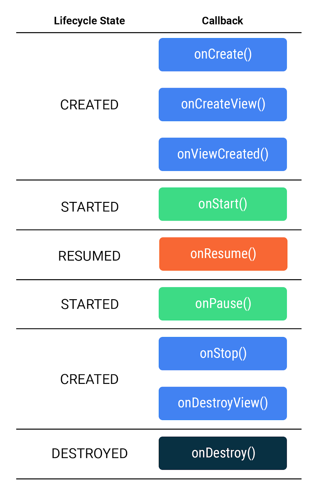
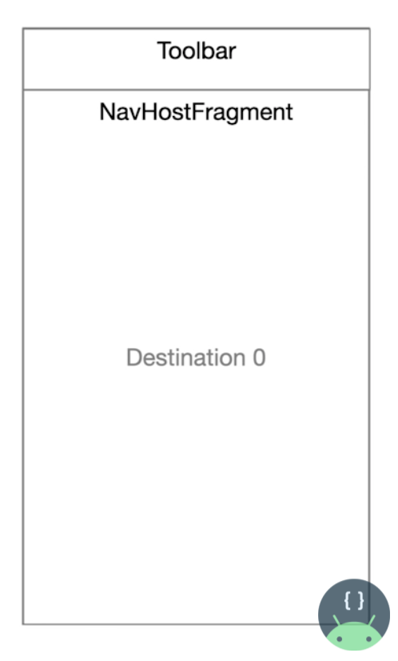
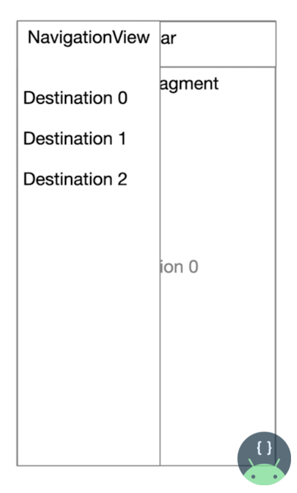

# 💡 Android Basics in Kotlin

## Unit #3 : Navigation

## PATHWAY #2 : Introduction to the Navigation component

<br/>

## 👩🏻‍💻 프래그먼트 & 탐색 구성요소

#### 👉 프래그먼트

- 재사용 가능한 UI의 부분
- 하나의 UI 내에서 독립적으로 동작하는 화면 부분을 만들고 싶을 때 사용한다. 활동의 뷰 계층 구조 내에 항상 포함, 동시에 호스팅 가능.
- 활동과 마찬가지로, 초기화되고 메모리에서 삭제될 수 있으며 존재하는 동안 화면에 표시되었다가 사라지고 다시 표시될 수 있다.

<br/>

#### 👉 프래그먼트 수명주기

- 각 프래그먼트는 별도의 자체 수명주기 관리

- 다섯 가지 상태
  - `INITIALIZED`: 프래그먼트의 새 인스턴스가 인스턴스화되었습니다.
  - `CREATED`: 첫 번째 프래그먼트 수명 주기 메서드가 호출됩니다. 이 상태에서 프래그먼트와 연결된 뷰도 만들어집니다.
  - `STARTED`: 프래그먼트가 화면에 표시되지만 '포커스'가 없으므로 사용자 입력에 응답할 수 없습니다.
  - `RESUMED`: 프래그먼트가 표시되고 포커스가 있습니다.
  - `DESTROYED`: 프래그먼트 객체의 인스턴스화가 취소되었습니다.
- 메서드
  - `onCreate()`: 프래그먼트가 인스턴스화되었고 `CREATED` 상태입니다. 그러나 이에 상응하는 뷰가 아직 만들어지지 않았습니다.
  - `onCreateView()`: 이 메서드에서 레이아웃을 확장합니다. 프래그먼트가 `CREATED` 상태로 전환되었습니다.
  - `onViewCreated()`: 뷰가 만들어진 후 호출됩니다. 이 메서드에서 일반적으로 `findViewById()`를 호출하여 특정 뷰를 속성에 바인딩합니다.
  - `onStart()`: 프래그먼트가 `STARTED` 상태로 전환되었습니다.
  - `onResume()`: 프래그먼트가 `RESUMED` 상태로 전환되었고 이제 포커스를 보유합니다(사용자 입력에 응답할 수 있음).
  - `onPause()`: 프래그먼트가 `STARTED` 상태로 다시 전환되었습니다. UI가 사용자에게 표시됩니다.
  - `onStop()`: 프래그먼트가 `CREATED` 상태로 다시 전환되었습니다. 객체가 인스턴스화되었지만 더 이상 화면에 표시되지 않습니다.
  - `onDestroyView()`: 프래그먼트가 `DESTROYED` 상태로 전환되기 직전에 호출됩니다. 뷰는 메모리에서 이미 삭제되었지만 프래그먼트 객체는 여전히 있습니다.
  - `onDestroy()`: 프래그먼트가 `DESTROYED` 상태로 전환됩니다.

- ⁉️ 활동과 프래그먼트 차이는? : 활동에서는 `onCreate()` 사용하여 레이아웃 확장하고 뷰를 바인딩하지만, 프래그먼트 수명 주기에서 `onCreate()`는 뷰가 만들어지기 전에 호출되므로 여기서 레이아웃을 확장할 수 없다. 대신 `onCreateView()`에서 확장한다.



<br/>

#### 👉 프래그먼트 생성

- `app` 누른 상태로 `File > New > Fragment > Fragment(Blank)` 하면 클래스와 레이아웃 파일이 각각 생성

- 바인딩

  ```kotlin
  private var _binding: FragmentLetterListBinding? = null
  private val binding get() = _binding!!
  ```

- `activity_main.xml` `activity_detail.xml` 내용 복사해서 `fragment_,,,.xml`로 이동 

- `MainActivity`, `DetailActivity`를 `프래그먼트`로 이전 

- 프래그먼트가 뷰에 표시되도록 레이아웃 확장

- ⁉️ 주의점 : 프래그먼트는 `Context`가 아니다.`this`를 레이아웃 관리자의 컨텍스트로 전달 불가능. 대신 사용할 수 있는 `context` 속성 제공됨. ( `this`->`this.requireContext()`로 바꿔줌. )

<br/>

#### 👉 Jetpack 탐색 구성요소

- 탐색 구성요소 : 앱 내에서 탐색을 구현하고 수정하기 위한 도구이자 API

- 탐색 그래프(`NavGraph`) : 앱에서 탐색을 시각적으로 보여주는 XML파일. 앱 탐색의 가상 매핑. 각  화면(프래그먼트)는 이동가능한 대상이 된다.

- `NavHost` : 활동 내에서 탐색 그래프의 대상을 표시하는 데 사용된다.

- `NavController` : `NavController` 객체를 사용하면 `NavHost`에 표시되는 대상 간 탐색을 제어할 수 있다.  `navigate()` 메서드를 호출하여 표시되는 프래그먼트를 교체할 수 있다. 시스템 '위로' 버튼에 응답하여 이전에 표시된 프래그먼트로 다시 이동하는 것과 같은 일반적인 작업을 처리 가능하다.

- 탐색 종속 항목

  - `build.gradle(project)` > `buildscript` > `ext` 

    ```kotlin
     nav_version = "2.3.1"
    ```

  - `build.gradle(app)` 

    ```kotlin
    implementation "androidx.navigation:navigation-fragment-ktx:$nav_version"
    implementation "androidx.navigation:navigation-ui-ktx:$nav_version"
    ```

- Safe Args 플러그인

  - 프래그먼트 간에 데이터 전달할 때 유형 안전성을 지원하는 플러그인 

  - `build.gradle(project) > buildscript > dependencies`

    ```kotlin
    classpath "androidx.navigation:navigation-safe-args-gradle-plugin:$nav_version"
    ```

  - `build.gradle(app) > plugins`

    ```kotlin
    id 'androidx.navigation.safeargs.kotlin'
    ```

<br/>

#### 👉 탐색 그래프 사용

- MainActivity에서 **FragmentContainerView** 사용

  - MainActivity의 용도를 변경하여 프래그먼트의 NavHost 역할을 할 FragmentContainerView를 포함한다.

  - 앱의 모든 탐색은 FragmentContainerView내에서 실행된다.

  - `activity_main.xml`에서 `RecyclerView`삭제 후 수정

    ```xml
    <androidx.fragment.app.FragmentContainerView
            android:id="@+id/nav_host_fragment"                                      
            android:name="androidx.navigation.fragment.NavHostFragment"
            android:layout_width="match_parent"
            android:layout_height="match_parent"
            app:defaultNavHost="true"
            app:navGraph="@navigation/nav_graph" />
    ```

  - `FrameLayout` 상단

    ```xml
    xmlns:app="http://schemas.android.com/apk/res-auto"
    ```

- 탐색 그래프 설정 
  - `File > New > Android Resource File`에서 리소스 유형은 `Navigation`으로 생성
  - 상단 왼쪽에서 각 프래그먼트의 대상 생성


<br/>

#### 👉 WordListFragment에서 인수 가져오기

- `WordListFragment` 추가

  ```kotlin
  private lateinit var letterId: String
  override fun onCreate(savedInstanceState: Bundle?) {
      super.onCreate(savedInstanceState)
  
      arguments?.let {
          letterId = it.getString(LETTER).toString()
      }
  }
  ```

- `onViewCreated()` 수정

  ```kotlin
  recyclerView.adapter = WordAdapter(letterId, requireContext())
  ```

<br/>

## 👩🏻‍💻 탐색 : 개요 - MAD(Modern Android Development) Skills

#### 👉 템플릿 살펴보기

- Basic Activity 
  - 2개의 프래그먼트 (버튼 누르면 이동)
  - 목적지 간 작업 있다.
- Navigation Drawer Activity
  - 프래그먼트 3개, 목적지 간 작없 없음
  - 메뉴 누르면 탐색 창 팝업 뜨는데, 그 창을 이용하여 목적지 간 이동

#### 👉 Navigation Pieces

- Toolbar
- NavHostFragment 
  - 활동을 통해 탐색할 때 대체되는 프래그먼트를 담는 컨테이너
  - 탐색 구성요소가 교환되는 목적지 컨테이너 역할

- NavController 
  - 탐색 구성요소의 내부 요소로, 실제 탐색작업을 한다. 
- NavigationView
  - 탐색 창 내에 있는 메뉴와 관련. 탐색 구성요소의 일부가 아니며 탐색 구성요소의 항목과 상호작용
- NavigationUI
  - 탐색 구성요소 라이브러리에서 NavHostFragment 외부 콘텐츠 업데이트를 책임
- +) Destination 0부터 시작





<br/>

<br/>

------

## 👩🏻‍💻 퀴즈

1. True or False: `onCreateView()` is only called once for a fragment’s entire lifecycle.

   > False

2. Which of the following is a benefit of using fragments?

   > Navigation between fragments allows for more sophisticated user interface patterns, such as tab bars.

   > Using multiple fragments within an activity allows for an adaptive layout across multiple screen sizes.

   > The same fragments can be reused across multiple activities.

3. In the fragment lifecycle, which of the following tasks should be performed in `onViewCreated()`?

   > Binding view objects to properties in your fragment

   > Setting properties of individual views, such as a recycler view’s adapter

4. In the fragment lifecycle, which of the following tasks should be performed in `onCreateView()`?

   > Inflating the layout

5. The [             ] method needs to be overridden in the host activity to ensure your app’s fragment-based navigation responds to the app’s "Up" button.

   > 틀림

6. Given the code for navigating between two fragments in a note-taking app, a list of books and a list of notes, which of the following is true about the navigation graph file?

   ```kotlin
   val action = BooksListFragmentsDirections.actionBooksListToNotesList(bookIndex = index)
   holder.view.findNavController().navigate(action)
   ```

   > Both the books list and notes list are destinations.

   > There’s an action defined on the navigation graph that goes from the books list to the notes list.