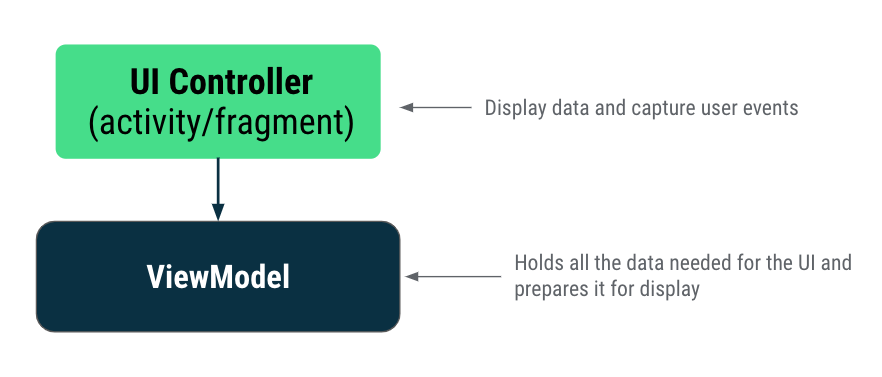
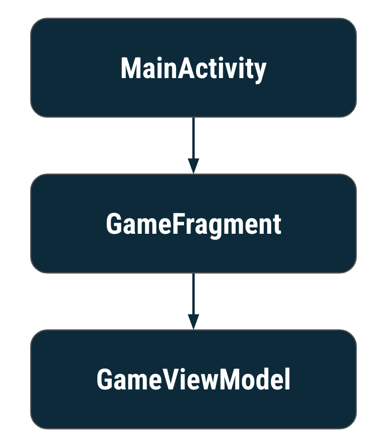
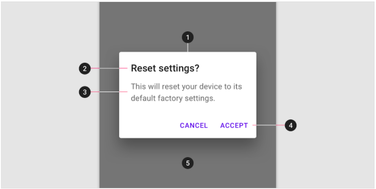

# 2021 Landvibe Summer Coding - Android

## Unit3 : Navigation

### PathWay3 : Architecture components


##### :rocket: ViewModel에 데이터 저장

- **아키텍처**

  - 앱에서 클래스 간의 책임을 할당한느 가이드라인을 제공

  - **아키텍처 원칙**

    - **관심사 분리**

      : 각각 별개의 책임이 있는 여러 클래스로 앱을 나눠야 한다는 원칙

    - **모델에서 UI 만들기**

      : 모델에서 UI를 만들어야 한다는 원칙 (지속적인 모델 권장)

      - 모델

        - 앱의데이터 처리를 담당하는 구성요소

        - View객체와 앱이 구성요소와 독립되어있어 앱의 수명 주기에 영향 받지 않는다.

  ***

  - **기본 클래스 or 구성요소**

    - **UI 컨트롤러(활동/프래그먼트)**

      - 화면에 뷰를 그리고 사용자 이벤트나 사용자가 상호작용 하는 다른 모든 UI 관련 동작을 캡쳐하여 UI를 제어
      - 앱 데이터나 상태를 저장 :x:, 데이터에 관한 의사결정 로직 :arrow_forward: ViewModel
      - 책임 : 활동 및 프래그먼트는 뷰와 데이터를 화면에 그리고 사용자 이벤트에 응답

      

    ***

    - **ViewModel**

      - 뷰에 표시되는 앱 데이터의 모델
      - activity나 fragment가 소멸되고 다시 생성될 때 폐기되지 않는 앱 관련 데이터를 저장
      - 책임 : UI에 필요한 모든 데이터를 보유하고 처리, 뷰 계층 구조(예: 뷰 결합 객체)에 액세스하거나 활동 또는 프래그먼트의 참조를 보유해서는 안 됨

      

      ***

      - View 모델 추가

        ```````kotlin
        class GameViewModel : ViewModel() {
            
            private var score = 0
            private var currentWordCount = 0
            private var currentScrambledWord = "test"
        ...
        ```````

        ```````kotlin
        // GameViewModel 초기화
        //viewModel 객체의 책임을 viewModels(대리자클래스)라는 별도 클래스에 위임
        private val viewModel: GameViewModel by viewModels()
        ```````

        - Kotlin 속성 위임

          : getter-setter 책임을 다른 클래스에 넘길 수 있다 :arrow_forward: `by`

          - `var` - getter함수 setter함수
          - `val` - getter함수

          ``````kotlin
          // Syntax for property delegation
          var <property-name> : <property-type> by <delegate-class>()
          ``````

        - 지원 속성

          : 정확한 객체가 아닌 getter에서 무언가를 반환할 수 있다

          ``````kotlin
          private var _currentScrambledWord = "test"
          val currentScrambledWord: String
             get() = _currentScrambledWord
          
          private fun updateNextWordOnScreen() {
             binding.textViewUnscrambledWord.text = viewModel.currentScrambledWord
          }
          ``````

        ***

        - ViewModel의 수명 주기

        

        ``````kotlin
        class GameViewModel : ViewModel() {
           init {
               Log.d("GameFragment", "GameViewModel created!")
           }
        
            //ViewModel이 소멸되기 직전 콜백 호출
           override fun onCleared() {
            	super.onCleared()
            	Log.d("GameFragment", "GameViewModel destroyed!")
        	}
            
            //처음 생성, 구성변경과 같은 모든 이벤트에 관해 프래그먼트ㅏ 다시 생성될 때마다 트리거됨
            override fun onCreateView(
               inflater: LayoutInflater, container: ViewGroup?,
               savedInstanceState: Bundle?
            ): View {
               binding = GameFragmentBinding.inflate(inflater, container, false)
               Log.d("GameFragment", "GameFragment created/re-created!")
               return binding.root
            }
            
            //프래그먼트가 소멸될 때 호출
            override fun onDetach() {
                super.onDetach()
                Log.d("GameFragment", "GameFragment destroyed!")
            }
            
            
        }
        ``````

      ***

      - ViewModel 채우기

        - 지연 초기화 : 나중에 초기화, `lateinit`

        ``````kotlin
        init {
            Log.d("GameFragment", "GameViewModel created!")
            getNextWord()
        }
        
        private var wordsList: MutableList<String> = mutableListOf()
        private lateinit var currentWord: String
        private lateinit var _currentScrambledWord: String
        
        private fun getNextWord() {
           	currentWord = allWordsList.random()
           	val tempWord = currentWord.toCharArray()
        	while (tempWord.toString().equals(currentWord, false)) {
                tempWord.shuffle()
            }
            
            if (wordsList.contains(currentWord)) {
                getNextWord()
            } else {
                _currentScrambledWord = String(tempWord)
                ++currentWordCount
                wordsList.add(currentWord)
            }
        }
        
        fun nextWord(): Boolean {
            return if (currentWordCount < MAX_NO_OF_WORDS) {
                getNextWord()
                true
            } else false
        }
        ``````

      ***

      - 대화상자

        

        1. 알림 대화상자
        2. 제목(선택사항)
        3. 메시지
        4. 텍스트 버튼

        ``````kotlin
        private var _score = 0
        val score: Int
           get() = _score
        
        private fun showFinalScoreDialog() {
            //requireContext는 null이 아닌 Context를 반환한다
            //프래그먼트의 컨텍스트를 전달하여 알림 대화상자를 만든다.
           	MaterialAlertDialogBuilder(requireContext())
               .setTitle(getString(R.string.congratulations))
               .setMessage(getString(R.string.you_scored, viewModel.score))
               .setCancelable(false)
               .setNegativeButton(getString(R.string.exit)) { _, _ ->
                   exitGame()
               }
               .setPositiveButton(getString(R.string.play_again)) { _, _ ->
                   restartGame()
               }
               .show() //알림 대화상자를 만들고 표시
        }
        ``````

        :key: `Context` : 애플리케이션, 활동, 프래그먼트의 컨텍스트나 현재 상태를 의미

      ***

      - Skip 버튼 구현

        ``````kotlin
        private fun onSkipWord() {
            if (viewModel.nextWord()) {
                setErrorTextField(false)
                updateNextWordOnScreen()
            } else {
                showFinalScoreDialog()
            }
        }
        ``````

    ***

    - `LiveData`

    - `Room`


***


##### :rocket: ViewModel과 함께 LiveData 사용

- `LiveData`

  : 수명 주기를 인식하는 식별 가능한 데이터 홀더 클래스

  - 데이터를 보유
    - 모든 유형의 데이터에 사용할 수 있는 래퍼
  - 관찰 가능
    - `LiveData` 객체에서 보유한 데이터가 변경되면 관찰자에 알림이 제공됨
  - 수명 주기를 인식
    - `LiveData`에 관찰자를 연결하면 관찰자는 `LifecycleOwner`(일반적으로 활동 또는 프래그먼트)와 연결 됨
    -  `LiveData`는 `STARTED` 또는 `RESUMED`와 같은 활성 수명 주기 상태인 관찰자만 업데이트

  - **데이터 결합**

    : 선언전 형식을 사용하여 레이아웃의 UI 구성요소를 앱의 데이터 소스에 바인딩

    : 코드에서 데이터를 뷰 + 뷰 결합에 결합(뷰를 코드에 결합)하는 것


***


#####  :rocket: Quiz

1. 다음 중 ViewModel을 사용하는 이유는 무엇인가요?

   *적절한 답변을 모두 선택합니다.*

   - ViewModel 및 관련 데이터는 활동/프래그먼트의 방향 변경사항을 유지할 수 있습니다.
   - ViewModel을 사용하면 UI 또는 수명 주기에 의존하지 않아도 되는 코드에서 UI를 업데이트하는 코드를 분리할 수 있습니다.


2. 다음 중 언제 ViewModel이 소멸되나요?
   - `onDestroy` 후(구성 변경이 아닌 경우)


3. 참 또는 거짓: 활동/프래그먼트에서 시간이 오래 걸리는 작업 및 I/O 요청을 실행해야 합니다.
   - 거짓


4. UI 컨트롤러 대신 ViewModel에서 LiveData를 초기화하고 저장해야 하는 이유는 무엇인가요?
   - 위 항목 모두
     - ViewModel과 LiveData가 모두 수명 주기를 인식하므로
     - UI 컨트롤러가 소멸될 때 LiveData가 소멸되지 않도록 하기 위해
     - 구현 세부정보를 숨기거나 분리하여 앱의 유연성을 향상하기 위해


5. `observe`를 사용하면 변경을 위해 다음 중 무엇을 할 수 있나요?

   - LiveData 객체

   

6. 참 또는 거짓: ViewModel에서 `View` 또는 `LifecycleOwner` 클래스를 직접 참조해도 괜찮습니다.

   - 거짓

