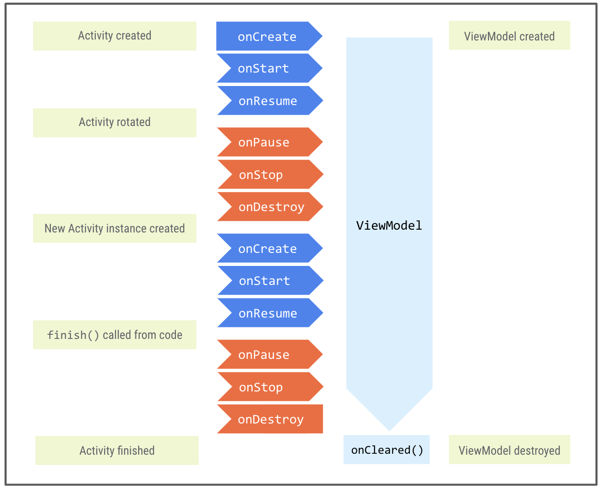

### Unit 3: Layouts

#### PATHWAY 3:Architecture components

<hr/>

#### &#10004; ViewModel에 데이터 저장

##### Android Jetpack

Android Jetpack 라이브러리는 Android앱을 더 간편하게 개발하기 위해 활용할 수 있는 라이브러리 컬렉션. 이 라이브러리에 포함된 Android 아키텍쳐 구성요소는 효율적인 아키텍처로 앱을 디자인하는데 도움을 줌. 아키텍처 구성요소는 권장사항으로,  앱 아키텍처를 안내하는 역할을 함.

##### 앱 아키텍처

앱 아키텍처는 일련의 디자인 규칙. 아키텍처는 앱의 구조를 제시. 

가장 일반적인 아키텍처 원칙은 관심사 분리, 모델에서 UI만들기.

###### 관심사 분리

각각 별개의 책임이 있는 여러 클래스로 앱을 나눠야한다.

###### 모델에서 UI만들기

모델에서 UI를 만들어야 하는데 가급적 지속적인 모델을 권장. 모델은 앱의 데이터 처리를 담당하는 구성요소로, 앱의 `View`객체 및 앱 구성요소와 독립되어 있으므로 앱의 수명 주기 및 관련 문제의 영항을 받지 않음.

Android 아키텍처의 기본 클래스 또는 구성요소는 UI 컨트롤러(Activity/Fragment),`ViewModel`, `LiveData`, `Room`입니다. 이러한 구성요소는 수명주기의 복잡성을 어느 정도 처리하므로 수명 주기 관련 문제를 피하는 데 도움이 됨. 

아키텍처의 기본적인 부분


##### UI 컨트롤러(Activity/Fragment)

UI 컨트롤러는 화면에 뷰를 그리고 사용자 이벤트나 사용자가 상호작용하는 다른 모든 UI관련 동작을 캡쳐하여  UI를 제어. 앱의 데이터 또는 데이터에 관한 모든 의사 결정 로직은 UI 컨트롤러 클래스에 포함되어서는 안됨. Android 시스템은 특정 사용자 상호작용을 기반으로 또는 메모리 부족과 같은 시스템 조건으로 인해 언제든지 UI 컨트롤러를 제거할 수 있음. 이러한 이벤트는 개발자가 직접 제어할 수 없기에 UI 컨트롤러에 앱 데이터나 상태를 저장하는 대신 데이터에 관한 의사 결정 로직을 `ViewModel`에 추가해야함.

##### ViewModel

`ViewModel`은 뷰에 표시되는 앱 데이터의 모델. 모델은 앱의 데이터 처리를 담당하는 구성요소로, 아키텍처 원칙에 따라 모델에서 UI가 도출되는 앱을 만들 수 있음. 

`ViewModel`은 Android 프레임워크에서 Activity나 Fragment가 소멸되고 다시 생성될 때 폐기되지 않는 앱 관련 데이터를 저장. `ViewModel` 객체는 구성이 변경되는 동안 자동으로 유지되어(Activity나 Fragment 인스턴스 처럼 소멸되지 않음)보유하고 있는 데이터가 다음 Activity 또는 Fragment 인스턴스에서 즉시 사용될 수 있음. 앱에 `ViewModel`을 구현하려면 아키텍처 구성요소 라이브러리에서 가져온 `ViewMdoel` 클래스를 확장하고 이 클래스 내에 앱 데이터를 저장.

| 프래그먼트/활동(UI 컨트롤러)의 책임                          | `ViewModel`의 책임                                           |
| ------------------------------------------------------------ | ------------------------------------------------------------ |
| 활동 및 프래그먼트는 뷰와 데이터를 화면에 그리고 사용자 이벤트에 응답합니다. | `ViewModel`은 UI에 필요한 모든 데이터를 보유하고 처리합니다. 뷰 계층 구조(예: 뷰 결합 객체)에 액세스하거나 활동 또는 프래그먼트의 참조를 보유해서는 안 됩니다. |

##### ViewModel을 프래그먼트에 연결하기

`ViewModel`을 UI컨트롤러에 연결하려면 UI컨트롤러 내에 `ViewModel`에 관한 참조를 만듦.

```kotlin
private val viewModel: GameViewModel by viewModels()
```

#### Kotlin 속성 위임

var 프로퍼티에는 자동으로 getter함수와 setter함수가 있음. 값을 할당하거나 프로퍼티 값을 읽을때 setter및 getter함수가 호출됨.

val은 getter 함수만 생성됨. 프로퍼티 값을 읽을때 getter함수가 호출됨.

속성 위임을 사용하면 getter-setter 책임을 다른 클래스에 넘길 수 있음. 이 클래스(대리자 클래스)는 프로퍼티의 getter 및 setter 함수를 제공하고 변경사항을 처리. 

```kotlin
// Syntax for property delegation
var <property-name> : <property-type> by <delegate-class>()
```

앱에서서 속성 위임을 하지않고 기본 생성자를 사용하여 뷰 모델을 초기화하는경우

```kotlin
private val viewModel = GameViewModel()
```

기기에서 구성이 변경되는 동안 앱이 `viewModel` 참조의 상태를 손실하게 됨. 예를 들어 기기를 회전하면 Activity가 소멸된 후 다시 생성되고 초기 상태의 새로운 뷰 모델 인스턴스가 재시작됨.

대신 속성 위임 접근 방식을 사용해 `viewModel`객체의 책임을 `viewModels`라는 별도의 클래스에 위임. 즉 `viewModel`객체에 엑세스하면 이 객체는 대리자 클래스 `viewModels`에 의해 내부적으로 처리됨. 대리자 클래스는 첫 번째 엑세스시 자동으로 `viewModels`객첼르 만들고 이 값을 구성 변경 도중에도 유지했다가  요청이 있을때 반환.

##### ViewModel로 데이터 이동하기

`ViewModel`내에서는 데이터를 수정할 수 있어여 하므로 데이터는 `private`이고 `var`여야함. `ViewMdeol` 외부에서는 데이터를 읽을 수 있지만 수정할 수는 없어야 하므로 `public`및 `val`로 노출되어야 함. 이 동작을 실현하기위해 지원 속성이라는 기능이 존재.

##### 지원속성

지원 속성을 사용하면 정확한 객체가 아닌 getter에서 무언가를 반환할 수 있음. 코틀린은 모든 속성별로 getter와 setter를 생성하는데 getter메서드와 setter 메서드 중 하나 또는 둘 모두를 재정의해 고유한 맞춤 동작을 제공할 수 있음. 지원 속성을 구현하려면 읽기 전용 버전의 데이터를 반환하도록 getter 메서드를 재정의 

지원 속성의 예시:

```kotlin
// Declare private mutable variable that can only be modified
// within the class it is declared.
private var _count = 0

// Declare another public immutable field and override its getter method.
// Return the private property's value in the getter method.
// When count is accessed, the get() function is called and
// the value of _count is returned.
val count: Int
   get() = _count
```

`ViewModel` 클래스 내부:

- `_count` 속성이 `private`이며 변경 가능합니다. 따라서 `ViewModel` 클래스 내에서만 액세스하고 수정할 수 있습니다. 이름 지정 규칙은 `private` 속성 앞에 밑줄을 붙이는 것입니다.

`ViewModel` 클래스 외부:

- Kotlin의 기본 공개 상태 한정자는 `public`이므로, `count`는 공개 속성이며 UI 컨트롤러와 같은 다른 클래스에서 액세스할 수 있습니다. `get()` 메서드만 재정의되므로, 이 속성은 변경할 수 없으며 읽기 전용입니다. 외부 클래스가 이 속성에 액세스하면 `_count`의 값을 반환하며, 이 값은 수정할 수 없습니다. 이에 따라 `ViewModel`에 있는 앱 데이터가 외부 클래스로 인해 원치 않게, 안전하지 않게 변경되지 않도록 보호되지만 외부 호출자는 값에 안전하게 액세스할 수 있습니다.

##### ViewModel의 수명주기



프레임워크는 Activity나 Fragment의 범위가 유지되는 동안 `ViewModel`을 유지. `ViewModel`은 소유자가 화면 회전과 같은 구성 변경으로 인해 소멸되는 경우에도 소멸되지 않음. 소유자의 새 인스턴스는 `ViewModel`인스턴스에 다시 연결

###### init

객체 인스턴스 초기화 중에 필욯나 초기 설정 코드를 배치하는 장소로 이니셜라이저 블록이 존재. 이 코드 블록은 객체 인스턴스가 처음 생성되어 초기화 될 때 실행됨. 

###### lateinit

변수 선언시 일반적으로 초깃값을 제공. 그러나 속성을 사용하기 전에 초기화할 것을 보장한다면`lateinit`을 사용해 초기화를 지연할수 있음. 

##### 대화상자

대화상자는 UI와 관련이 있으므로 `GameFragment`가 대화상자 생성과 표시를담당.

머티리얼 디자인 구성요소 라이브러리의 `MaterialAlertDialog`를 사용.

`MaterialAlertDialog`를 만들려면 `MaterialAlertDialogBuilder` 클래스를 사용하여 대화상자의 부분을 단계별로 빌드. 프래그먼트의 `requireContext()`메서드를 사용하여 콘텐츠를 전달하는 `MaterialAlertDialogBuilder` 생성자를 호출. `requireContext()` 메서드는 null이 아닌 `Context`를 반환.

`Context`는 애플리케이션,Acitivity,Fragment의 컨텍스트나 현재 상태를 의미.  관련 정보를 포함하고 있으며 일반적으로 리소스, 데이터페이스, 기타 시스템 서비스에 엑세스하는데 사용.

##### 텍스트 필드에 오류 표시

머티리얼 텍스트 필드는 `TextInputLayout`에 오류 메세지를 표시하는 기능이 내장되어 있음.

```kotlin
// Set error text
passwordLayout.error = getString(R.string.error)

// Clear error text
passwordLayout.error = null
```

##### Livedata

`LiveData`는 수명 주기를 인식하는 식별 가능한 데이터 홀더 클래스

- `LiveData`는 데이터를 보유합니다. `LiveData`는 모든 유형의 데이터에 사용할 수 있는 래퍼입니다.
- `LiveData`는 관찰 가능합니다. 즉, `LiveData` 객체에서 보유한 데이터가 변경되면 관찰자에 알림이 제공됩니다.
- `LiveData`는 수명 주기를 인식. `LiveData`에 관찰자를 연결하면 관찰자는 `LifecycleOwner`(일반적으로 Activity 또는 Fragment)와 연결됨. `LiveData`는 `STARTED` 또는 `RESUMED`와 같은 활성 수명주기 상태인 관찰자만 업데이트.

###### 관찰자

관찰자 패턴은 옵저버들의 목록을 객체에 등록해서 상태변화가 있을 때마다 메서드를 통해 객체가 직접 목록의 각 옵저버에 알리도록 하는 디자인 패턴. 이 패턴의 핵심은 옵저버 또는 리스너라 불리는 하나 이상의 객체를 관찰 대상이 되는 객체에 등록. 그리고 각각의 옵저버들은 관찰 대상인 객체가 발생시키는 이벤트를 받아 처리. 이벤트가 발생하면 각 옵저버는 콜백을 받음.

`LiveData`객체  내의 데이터에 엑세스하려면 `value`속성을 사용

```kotlin
private fun getNextWord() {
 ...
   } else {
       _currentScrambledWord.value = String(tempWord)
       ...
   }
}
```

`LiveData`는 수명 주기를 인식하므로 `GameFragment`의 관찰자는 `GameFragment`가 `STARTED`또는 `RESUMED`상태인 경우에만 알림을 받음.

```kotlin
// Observe the scrambledCharArray LiveData, passing in the LifecycleOwner and the observer.
viewModel.currentScrambledWord.observe(viewLifecycleOwner,
   { newWord ->
       binding.textViewUnscrambledWord.text = newWord
   })
```

`observe()`메서드에 `viewLifecycleOwner`(프래그먼트의 뷰 수명주기)를 매개변수로 넣어 `LiveData`가 `GameFragment` 수명주기를 인식할 수 있게 해줌.

##### 데이터 결합과 함께 LiveData사용하기

###### 뷰 결합

뷰 결합은 코드에서 뷰에 더 쉽게 엑세스할 수 있는 기능으로 각 XML레이아웃 파일의 결합 클래스를 생성. 결합 클래스의 인스턴스에 상응하는 레이아웃에 id가 있는 모든 뷰의 직접 참조가 포함됨. 뷰 결합을 사용하면 뷰(레이아웃 파일)에서 앱 데이터를 참조할 수 없는데 이 작업은 데이터 결합을 사용하면 됨.

###### 데이터 결합

데이터 결합 라이브러리는 Android Jetpack 라이브러리의 일부. 데이터 결합은 선언적 형식을 사용해 레이아웃의 UI구성 요소를 앱의 데이터 소스에 바인딩. 간단히 말해 코드에서 데이터를 뷰+ 뷰 결합에 결합(뷰에 코드를 결합)하는 것.

UI컨트롤러에서 뷰 결합 사용의 예

```
binding.textViewUnscrambledWord.text = viewModel.currentScrambledWord
```

레이아웃 파일에서 데이터 결합 사용의 예

```
android:text="@{gameViewModel.currentScrambledWord}"
```

데이터 결합을 사용하면 Activity에서 많은 UI프레임 워크 호출흘 삭제할 수 있어 파일이 더욱 단순해지고 더 손쉬운 유지관리가 가능함. 또 앱 성능이 향상되며 메모리 누수 및 null포인터 예외를 방지할 수 있음.

###### 뷰 결합-> 데이터 결합

1.build.gradle(Module)

```
buildFeatures {
   dataBinding = true
}
```

2. 코틀린 프로젝트에서 데이터 결합을 사용하려면 kotlin-kapt 플러그인을 적용해야함.

```
plugins {
   id 'com.android.application'
   id 'kotlin-android'
   id 'kotlin-kapt'
}
```

위의 단계는 앱의 모든 레이아웃 XML 파일용 결합 클래스를 자동으로 생성합니다. 레이아웃 파일 이름이 `activity_main.xml`인 경우 자동 생성 클래스의 이름은 `ActivityMainBinding`이 됩니다.

###### 레이아웃 파일-> 데이터 결합 레이아웃 변환

데이터 결합 레이아웃 파일은 약간 차이가 있으며 <layout>의 루트 태그로 시작하고 선택적 <data>요소 및 view 루트 요소가 뒤따름. 이 view요소는 루트가 결합 레이아웃 파일이 아닌 파일에 있는 요소.

##### 결합 표현식

결합 표현식은 레이아웃 내에서 레이아웃 속성을 참조하는 속성(ex:android.text)에서 작성됨. 레이아웃 속성은 <variable>태그를 통해 데이터 결합 레이아웃 파일의 상단에서 선언. 종족 변수중 하나라도 변경되면 db라이브러리가 결합 표현식을 실행하고 이에 따라 뷰를 업데이트함.

###### 결합 표현식의 구문

결합 표현식은 @기호로 시작하고 중괄호로 래핑.

```kotlin
<TextView android:layout_width="wrap_content"
          android:layout_height="wrap_content"
          android:text="@{user.firstName}" />
```

데이터 결합 표현식은 다음 구문을 사용해 앱 리소스를 참조할 수 있음.

```kotlin
android:padding="@{@dimen/largePadding}"
```

이 예에서는 `padding`속성에 `dimen.xml` 리소스 파일의 `largePadding`값이 할당됨. 

레이아웃 속성을 리소스 매개변수로 전달할 수도 있음.

```
android:text="@{@string/example_resource(user.lastName)}"
```

<hr/>

##### Quiz

1. 다음 중 ViewModel을 사용하는 이유는 무엇인가요?

- ViewModel 및 관련 데이터는 활동/프래그먼트의 방향 변경사항을 유지할 수 있습니다.

- ViewModel을 사용하면 UI 또는 수명 주기에 의존하지 않아도 되는 코드에서 UI를 업데이트하는 코드를 분리할 수 있습니다.

2. 다음 중 언제 ViewModel이 소멸되나요?

- `onDestroy` 후(구성 변경이 아닌 경우)

3. 참 또는 거짓: 활동/프래그먼트에서 시간이 오래 걸리는 작업 및 I/O 요청을 실행해야 합니다.

- 거짓

//앱의 데이터 또는 데이터에 관한 모든 의사 결정 로직은 UI 컨트롤러 클래스에 포함되어서는 안되어서?

4. UI 컨트롤러 대신 ViewModel에서 LiveData를 초기화하고 저장해야 하는 이유는 무엇인가요?

- ViewModel과 LiveData가 모두 수명 주기를 인식하므로

- UI 컨트롤러가 소멸될 때 LiveData가 소멸되지 않도록 하기 위해
- 구현 세부정보를 숨기거나 분리하여 앱의 유연성을 향상하기 위해

5. `observe`를 사용하면 변경을 위해 다음 중 무엇을 할 수 있나요?

- LiveData 객체

6. 참 또는 거짓: ViewModel에서 `View` 또는 `LifecycleOwner` 클래스를 직접 참조해도 괜찮습니다.

- 거짓

// ViewModel은 View,Lifecycle또는 Activity context 참조를 포함하는 클래스를 참조해서는 안됨.
