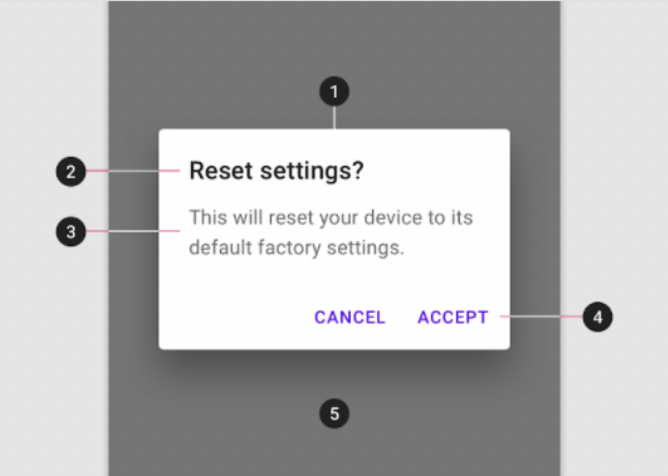
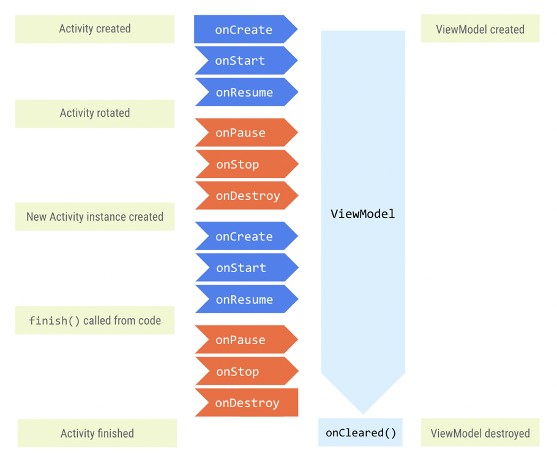

# 💡 Android Basics in Kotlin

## Unit #3 : Navigation

## PATHWAY #3 : Architecture components

<br/>

## 👩🏻‍💻 ViewModel에 데이터 저장

#### 👉 ViewModel

- 뷰에 표시되는 앱 데이터의 모델
  - 모델은 앱의 데이터 처리를 담당하는 구성요소로, 아키텍처 원칙에 따라 모델에서 UI가 도출되는 앱을 만들 수 있다.

- 안드로이드 프레임워크에서 활동이나 프래그먼트가 소멸되고 다시 생성될 때 폐기되지 않는 앱 관련 데이터를 저장한다.

- 객체는 구성이 변경되는 동안 자동으로 유지되어(활동 또는 프래그먼트 인스턴스처럼 소멸되지 않음) 보유하고 있는 데이터가 다음 활동 또는 프래그먼트 인스턴스에 즉시 사용될 수 있다.

<br/>

#### 👉 ViewModel 추가

- `MainActivity`에 `GameFragment`가 포함되어 있으며, `GameFragment`는 `GameViewModel`에 있는 게임 관련 정보에 액세스한다.
- `GameViewModel.kt` 생성
  - `ViewModel`의 서브클래스
- **지원 속성** : 정확한 객체가 아닌 getter에서 무언가를 반환할 수 있다. 읽기 전용 버전의 데이터를 반환하도록 getter 메서드를 재정의해서 지원 속성을 구현한다.
- **lateinit** : 지연 초기화. 속성을 나중에 초기화하려고 할 때 쓰는 키워드로 변수가 초기화될 때까지는 변수에 메모리가 할당되지 않아서 액세스하려고하면 앱 비정상으로 종료된다.

<br/>

#### 👉 대화상자

- 알림 대화상자 구성

  1. 알림 대화상자
  2. 제목(선택사항)
  3. 메시지
  4. 텍스트 버튼

  

<br/>

#### 👉 최종 코드 수정 부분

- `GameFragment.kt`  수정 부분

  ```kotlin
  class GameFragment : Fragment() {
      //GameFragmen 클래스 상단에 GameViewModel 유형의 속성 추가
      private val viewModel: GameViewModel by viewModels()
  
      // GameFragment에서 읽기 전용 viewModel 속성인 currentScrambledWord를 사용하도록 업데이트
      private fun updateNextWordOnScreen() {
          binding.textViewUnscrambledWord.text = viewModel.currentScrambledWord
      }
  
      private fun showFinalScoreDialog() {
         //프래그먼트 컨텍스트 전달하여 알림 대화상자 생성
         MaterialAlertDialogBuilder(requireContext())
            //대화상자 제목 설정
            .setTitle(getString(R.string.congratulations))
            //대화상자 최종 점수 표시
            .setMessage(getString(R.string.you_scored, viewModel.score))
            //뒤로 키를 눌러 알림 대화상자 취소할 수 없도록 함
            .setCancelable(false)
            .setNegativeButton(getString(R.string.exit)) { _, _ ->
                exitGame()
            }
            .setPositiveButton(getString(R.string.play_again)) { _, _ ->
                restartGame()
            }
            //알림 대화상자 만들고 표시
            .show()
  
      }
    	
    	//submit버튼
    	private fun onSubmitWord() {
        	val playerWord = binding.textInputEditText.text.toString()
        	//true인 경우 다른 단어 사용 가능 -> 다음 단어를 화면에 업데이트
          if (viewModel.isUserWordCorrect(playerWord)) {
              setErrorTextField(false)
              if (viewModel.nextWord()) {
                  updateNextWordOnScreen()
              } 
            	else {
                  showFinalScoreDialog()
              }
          } 
        	else {
          		setErrorTextField(true)
     			}
  		}
    
    	//skip버튼
    	private fun onSkipWord() {
          if (viewModel.nextWord()) {
              setErrorTextField(false)
              updateNextWordOnScreen()
          } else {
              showFinalScoreDialog()
          }
  		}
    	
      private fun setErrorTextField(error: Boolean) {
         if (error) {
             binding.textField.isErrorEnabled = true
             binding.textField.error = getString(R.string.try_again)
         } else {
             binding.textField.isErrorEnabled = false
             binding.textInputEditText.text = null
         }
   	 }
    
    private fun restartGame() {
       //재시작 메서드 호출
       viewModel.reinitializeData()
       setErrorTextField(false)
       updateNextWordOnScreen()
  	}
  }
  ```

- `GameViewModel.kt`  수정 부분

  ```kotlin
  class GameViewModel : ViewModel() {
    	//GameFragment 클래스에서 GameViewModel 클래스로 데이터 변수를 이동
      //대화상자 - score변수에 지원 속성 추가
  		private var _score = 0
  		val score: Int
     			get() = _score
    	//지원 속성
      private var _currentWordCount = 0
      val currentWordCount: Int
          get() = _currentWordCount
    
    	//지원 속성 사용하여 GameViewModel내에서만 _currentScrambledWord에 액세스하고 수정 가능하게 만들기
      private lateinit var _currentScrambledWord: String
      val currentScrambledWord: String
          get() = _currentScrambledWord
    
      //게임에 사용하는 단어의 목록 보유 -> 반복된 단어가 제시되지 않도록
      private var wordsList: MutableList<String> = mutableListOf()
      
      //플레이어가 추측해야 할 단어 보유하는 클래스 변수 (지연 초기화)
      private lateinit var currentWord: String
    	
    	init {
     		 Log.d("GameFragment", "GameViewModel created!")
         //첫 단어가 "test"여서, 앱 시작 시 뒤섞인 단어 표시하기 위해
     		 getNextWord()
  		}
    
    	private fun getNextWord() {
     			currentWord = allWordsList.random()
        	//문자열을 문자배열로 변환
        	val tempWord = currentWord.toCharArray()
        	//이 단어 배열의 글자 순서를 바꾸기
  				tempWord.shuffle()
        	// 섞은 단어가 원래 단어와 동일한 경우 처리
        	while (tempWord.toString().equals(currentWord, false)) {
     				 tempWord.shuffle()
  				}
        	//단어가 이미 사용되었는지 여부 확인
        	if (wordsList.contains(currentWord)) {
     				 getNextWord()
  				} else {
    		 		 _currentScrambledWord = String(tempWord)
    		 		 ++currentWordCount
     				 wordsList.add(currentWord)
  			}
  		}
    
    // ViewModel 내의 데이터를 처리하고 수정하는 도우미 메서드
    fun nextWord(): Boolean {
      return if (currentWordCount < MAX_NO_OF_WORDS) {
          getNextWord()
          true
      } else false
  	}
    
    private fun increaseScore() {
    		 _score += SCORE_INCREASE
  		}
    
  	//플레이어의 단어 검증, 추측한 단어가 올바르면 점수 올림.
    fun isUserWordCorrect(playerWord: String): Boolean {
       if (playerWord.equals(currentWord, true)) {
           increaseScore()
           return true
       }
       return false
    }
    
    // 게임 재시작 로직 - 단어 수 0으로 재설정
    fun reinitializeData() {
       _score = 0
       _currentWordCount = 0
       wordsList.clear()
       getNextWord()
  	}
  
  }
  ```

<br/>

#### 👉 ViewModel 수명 주기

- 소유자가 화면 회전과 같은 구성 변경으로 인해 소멸되는 경우에도 소멸되지 않는다. 소유자의 새 인스턴스는 다음 다이어그램과 같이 기존 `ViewModel` 인스턴스에 다시 연결된다.




<br/>

<br/>

## 👩🏻‍💻 ViewModel과 함께 LiveData 사용

#### 👉 Livedata

- **수명 주기를 인식하는 식별 가능한 데이터 홀더 클래스**
- 데이터를 보유하며, 모든 유형의 데이터에 사용할 수 있는 래퍼
- 관찰 가능하며, 보유한 데이터가 변경되면 관찰자에 알림이 제공
- 수명 주기를 인식하며, 활성 수명 주기 상태인 관찰자만 업데이트 함
- **`MutableLiveData`** : 변경 가능한 버전의 LiveData로, 내부에 저장된 데이터의 값을 변경 가능 
- **데이터 결합** : 코드에서 데이터를 뷰 + 뷰 결합에 결합(뷰를 코드에 결합)하는 것
  - 뷰 결합(단방향 결합) : 코드에서 뷰에 더 쉽게 액세스할 수 있는 기능, 각 XML 레이아웃 파일의 결합 클래스를 생성
  - `@{}` : 할당 표현식
  - 장점 : 활동에서 많은 UI 프레임워크 호출을 삭제할 수 있어 파일이 단순해지고 더 손쉬운 유지관리가 가능. 앱 성능이 향상되며 메모리 누수 및 null 포인터 예외를 방지

<br/>

<br/>

------

## 👩🏻‍💻 퀴즈

1. ##### 다음 중 ViewModel을 사용하는 이유는 무엇인가요?

   > ViewModel 및 관련 데이터는 활동/프래그먼트의 방향 변경사항을 유지할 수 있습니다.
   >
   > ViewModel을 사용하면 UI 또는 수명 주기에 의존하지 않아도 되는 코드에서 UI를 업데이트하는 코드를 분리할 수 있습니다.

2. ##### 다음 중 언제 ViewModel이 소멸되나요?

   > `onDestroy` 후(구성 변경이 아닌 경우)

3. ##### 참 또는 거짓: 활동/프래그먼트에서 시간이 오래 걸리는 작업 및 I/O 요청을 실행해야 합니다.

   > 거짓

4. ##### UI 컨트롤러 대신 ViewModel에서 LiveData를 초기화하고 저장해야 하는 이유는 무엇인가요?

   > ViewModel과 LiveData가 모두 수명 주기를 인식하므로
   >
   > UI 컨트롤러가 소멸될 때 LiveData가 소멸되지 않도록 하기 위해
   >
   > 구현 세부정보를 숨기거나 분리하여 앱의 유연성을 향상하기 위해

5. ##### `observe`를 사용하면 변경을 위해 다음 중 무엇을 할 수 있나요?

   > LiveData 객체

6. ##### 참 또는 거짓: ViewModel에서 `View` 또는 `LifecycleOwner` 클래스를 직접 참조해도 괜찮습니다.

   >  거짓
