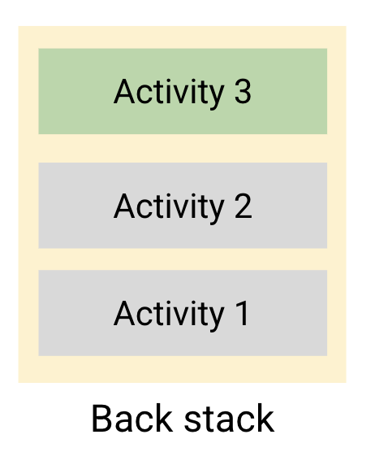

## 2021 Landvibe Summer Coding - Android

### 🔎 Android Basics In Kotlin

#### 📌 Unit3: Navigation

#### 📌 PathWay4: Advanced navigation app examples

<hr>

##### Cupcake 앱

: 온라인 주문 앱

👉🏻 공유 `ViewModel`을 사용하여 앱의 데이터를 단일 `ViewModel`에 저장

👉🏻 앱의 여러 프래그먼트는 활동 범위를 사용하여 공유 `ViewModel`에 액세스

👉🏻 `LifecycleOwner`: 활동/프래그먼트와 같이 수명 주기를 보유한 클래스

👉🏻 `LiveData`관찰자는 수명 주기 소유자가 활성 상태(STARTED/RESUMED)인 경우에만 앱 데이터의 변경사항을 관찰

👉🏻 `SimpleDateFormat`: 날짜 형식 지정하고 파싱하는 클래스

- 날짜 형식 지정(날짜->텍스트)

- 파싱(텍스트->날짜)


##### 작업

: 사용자가 이메일 확인, 컵케이크 주문 생성, 사진 촬영 등의 특정한 일을 할 때, 상호작용하는 활동의 모음

👉🏻 활동은 작업 내에 존재

##### 활동

: `백스택`이라는 스택으로 배열됨 / 사용자가 방문하는 각각의 새 활동은 작업의 백 스택으로 푸시됨

> 뒤로 이동하는 경우 유용

스택 맨 위에 있는 활동을 삭제하고 그 알 활동을 다시 시작할 수 있다!

👉🏻 스택 맨 위에 있는 활동: 현재 사용자가 상호작용하고 있는 활동

👉🏻 스택에서 그 아래에 있는 활동: 백그라운드로 전환되었다 중지




👉🏻 Jetpack 탐색 구성요소를 사용한다면/ 프래그먼트 대상을 백 스택으로 푸시하고 백 스택에서 팝할 수 있으므로 기본 Back 버튼 직접 구현할 필요 X

👉🏻 속성 값에 지정된 대상에 이를 때까지, 대상을 백 스택에서 팝하기 위해! 탐색 그래프에서 작업에 `app:popUpTo`속성을 지정

👉🏻 `app:popUpTo`에 지정된 대상->백 스택에 팝해야 하는 경우/`app:popUpToInclusive="true"`

👉🏻 암시적 인텐트 만들기: `Intent.ACTION_SEND`+추가항목(`Intent.EXTRA_EMAIL`, `Intent.EXTRA_SUBJECT`, `Intent.EXTRA_TEXT`)

👉🏻 `plurals` 리소스 for 수량에 따라 서로 다른 문자열 리소스 사용


📌 [솔루션 코드-1](https://github.com/google-developer-training/android-basics-kotlin-cupcake-app/tree/viewmodel)

📌 [솔루션 코드-2](https://github.com/google-developer-training/android-basics-kotlin-cupcake-app)


##### 퀴즈

1. 참 또는 거짓: 여러 활동 또는 프래그먼트에 동일한 ViewModel을 사용하여 데이터를 공유할 수 있습니다.

   > 참

2. Kotin 속성 위임 접근법을 사용하여 공유 뷰 모델에 액세스할 수 있는 올바른 방법은 무엇인가요?

   ```kotlin
   val viewModel: OrderViewModel by activityViewModels()
   ```

3. 빈 칸 채우기

   LiveData `Transformations`을 사용하여 다른 인스턴스의 값에 따라 다양한 LiveData 인스턴스를 반환합니다.

4. 객체를 구성하는 데 Kotlin의 `apply` 함수를 사용하려면 어떻게 해야 하나요?

   > 객체에 할당 세트를 적용할 수 있습니다.

5. 데이터 결합 레이아웃 표현식을 사용할 때 클릭 리스너를 결합하기 위해 이 레이아웃의 버튼에 속성을 추가하는 올바른 구문은 무엇인가요?

   ```kotlin
   <Button
       android:id="@+id/next_button"
       android:layout_width="wrap_content"
       android:layout_height="wrap_content"
       android:text="@string/next" />
   ```

   ```kotlin
   android:onClick="@{() -> detailFragment.next()}"
   ```

