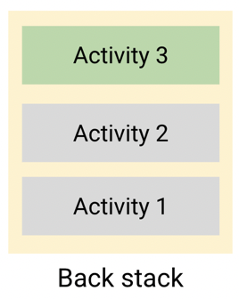

# 💡 Android Basics in Kotlin

## Unit #3 : Navigation

## PATHWAY #4 : Architecture components

<br/>

- `만들 것` : 
  - 컵케이크 주문 앱 (컵케이크 맛, 수량, 수령 날짜 선택 가능)

- `배울 것` :
  - 고급 사용 사례 내에서 권장 앱 아키텍처 사례 구현하는 방법
  - 활동의 프래그먼트 간에 공유 ViewModel을 사용하는 방법 -> 동일한 활동의 프래그먼트 간에 데이터 공유 방법
  - LiveData 변환 적용하는 방법

<br/>

## 👩🏻‍💻 프래그먼트 간 공유되는 ViewModel

- 프래그먼트 연결 및 버튼 눌렀을 때 프래그먼트 이동

- 앱 바 제목 업데이트 - NavController

<br/>

#### 👉 공유 ViewModel 생성

- 앱의 데이터를 단일 ViewModel에 저장

  - 컵케이크앱 : 주문 정보(가격, 수량, 맛, 수령 날짜)를 단일 뷰모델에 저장 -> `OrderViewModel`

- 앱의 여러 프래그먼트는 활동 범위를 사용하여 공유 ViewMoel에 액세스함

- 뷰 모델 데이터를 `private` 변수로 하는 것이 좋음, 필요한 경우만 `public `으로(외부에서 호출되어야 할 때 등)

  ```kotlin
  class OrderViewModel : ViewModel() {
    
      private val _quantity = MutableLiveData<Int>(0)
      val quantity: LiveData<Int> = _quantity
      private val _flavor = MutableLiveData<String>("")
      val flavor: LiveData<String> = _flavor
      private val _date = MutableLiveData<String>("")
      val date: LiveData<String> = _date
      private val _price = MutableLiveData<Double>(0.0)
      val price: LiveData<Double> = _price
     
      fun setQuantity(numberCupcakes: Int) {
          _quantity.value = numberCupcakes
      }
      fun setFlavor(desiredFlavor: String) {
          _flavor.value = desiredFlavor
      }
      fun setDate(pickupDate: String) {
          _date.value = pickupDate
      }
   
  }
  ```

  

<br/>

#### 👉 ViewModel 사용하여 UI업데이트

- 공유 뷰 모델 사용하려면 **viewModels()** 대리자 클래스 대신 **acivitiyViewModels()**를 사용

  - `activityViewModels()` : 현재 활동으로 범위가 지정된 `ViewModel` 인스턴스를 제공. 따라서 인스턴스는 동일한 활동의 여러 프래그먼트 간에 동일하게 유지됨.

- Kotlin 속성 위임 사용

  - 자동으로 생성되는 기본 getter 및 setter 함수 책임을 다른 클래스(대리자 클래스)에 넘길 수 있다.

    ```kotlin
    // Syntax for property delegation
    var <property-name> : <property-type> by <delegate-class>()
    
    // 사용 예시 - 공유할 모든 프래그먼트 클래스에 선언
    private val sharedViewModel : OrderViewModel by activityViewModels()
    ```


<br/>

#### 👉 데이터 결합과 함께 ViewModel 사용

- 데이터 결합(뷰를 코드에 결합)을 사용하여 뷰 모델 데이터를 UI에 결합하고 사용자가 UI에서 선택한 사항에 따라 공유 뷰 모델 업데이트하기

- **apply 범위 함수** : 객체의 컨텍스트 내에서 코드 블록을 실행하며 임시 범위를 형성 -> 범위 내에서 이름 사용 안하고 객체에 액세스 가능

  ```kotlin
  // 사용 예시
  
  clark.apply {
      firstName = "Clark"
      lastName = "James"
      age = 18
  }
  
  clark.firstName = "Clark"
  clark.lastName = "James"
  clark.age = 18
  ```

- 리스너 결합

  - 이벤트가 발생할 때 실행되는 람다 표현식

    ```xml
    <RadioButton
           ...
           android:onClick="@{() -> viewModel.setFlavor(@string/vanilla)}"
           .../>
    ```

<br/>

#### 👉 프래그먼트 업데이트

- 날짜 형식 지정 : `SimpleDateFormat` 클래스

  ㅇ 날짜의 형식 지정(날짜 -> 텍스트) 및 파싱(텍스트 -> 날짜) 가능
  
  ```kotlin
  SimpleDateFormat("E MMM d", Locale.getDefault())
  // "EEE, MMM d"는 "Wed, Jul 4"로 파싱
  // E : 요일, M : 달, d : 일, y : 연도
  
  // 컵케이크 앱 사용 코드
  private fun getPickupOptions(): List<String> {
  	  val options = mutableListOf<String>()
  	  val formatter = SimpleDateFormat("E MMM d", Locale.getDefault())
      val calendar = Calendar.getInstance()
      repeat(4) {
            options.add(formatter.format(calendar.time))
            calendar.add(Calendar.DATE, 1)
      }
     	return options
   }
  ```
  
  - `Locale` 객체는 특정한 지리적, 정치적 또는 문화적 지역을 나타내며 언어/국가/변형 조합 나타냄. `Locale.getDefault()` 메서드 사용하여 사용자의 기기에 설정된 언어 정보 가져와서 클래스 생성자에 전달

- `elvis 연산자 (?:)` : 왼쪽의 표현식이 null이 아니면 이 값을 사용. null이라면 오른쪽에 있는 표현식을 사용

<br/>

- LiveData를 관찰하도록 수명 주기 소유자 설정
  - `LifecycleOwner` : 활동이나 프래그먼트와 같이 안드로이드 수명 주기 보유한 클래스
  - `LiveData` 관찰자는 수명 주기 소유자가 활성 상태(`STARTED` 또는 `RESUMED`)인 경우에만 앱 데이터의 변경사항을 관찰
  - 컵케이크앱
    -  LiveData 객체 또는 관찰 가능한 데이터 : 뷰 모델의  `price` 속성
    - 수명 주기 소유자 : `flavor`, `pickup`,`summary ` 각각의 프래그먼트
  - 결합 표현식
    - `android:text="@{@string/subtotal_price(viewModel.price)}"`

  <br/>

- LiveData 변환을 사용하여 가격 형식 지정

  - `Transformations.map()` 메서드 사용하여 가격에 현지 통화 사용하도록 가격 형식 지정

<br/>

<br/>

## 👩🏻‍💻 탐색 및 백 스택

#### 👉 Up 버튼 동작 구현 

- `Up 버튼` : 이전화면으로 돌아가는 버튼 (뒤로가기)

  ```kotlin
  // 앱에서 위로 이동을 처리하도록 navController에 요청, 그러지 않으면 Up버튼 처리하는 슈퍼클래스 구현(AppCompatActivity)으로 대체
  
  override fun onSupportNavigateUp(): Boolean {
     return navController.navigateUp() || super.onSupportNavigateUp()
  }
  ```

  

  

<br/>

#### 👉 작업 및 백 스택

- 주문을 언제든지 취소하면 `StartFragment`로 사용자 이동

- **작업** : 사용자가 이메일 확인, 컵케이크 주문 생성 등 특정한 일을 할 때 상호작용하는 `활동`의 모음

  - **활동** : `백 스택` 이라는 스택으로 배열되며, 사용자가 방문하는 각각의 새 활동은 작업의 백 스택으로 푸시됨

- **백 스택** : 스택 맨 위에 있는 활동은 사용자가 현재 상호작용하고 있는 활동이며, 스택에서 그 아래에 있는 활동은 백그라운드로 전환되었다가 중지됨

  - 뒤로 이동하는 경우, 스택에서 활동을 팝하고 사용자가 상호작용할 수 있게 이전 활동이 포그라운드로 이동함
  - 백 스택에 더 이상 활동이 남아 있지 않으면 사용자는 기기의 런처 화면이나 이 활동을 실행한 앱으로 돌아감

  

<br/>

#### 👉 주문 전송

- 앱에서 다른 앱으로 정보를 공유 -> 사용자가 기기의 이메일 앱을 통해 컵케이크 상점에 주문을 이메일로 보내 컵케이크 주문 정보를 공유할 수 있음

  ```kotlin
  fun sendOrder() {
      val numberOfCupcakes = sharedViewModel.quantity.value ?: 0
      val orderSummary = getString(
          R.string.order_details,
          resources.getQuantityString(R.plurals.cupcakes, numberOfCupcakes, numberOfCupcakes),
          sharedViewModel.flavor.value.toString(),
          sharedViewModel.date.value.toString(),
          sharedViewModel.price.value.toString()
      )
  
      val intent = Intent(Intent.ACTION_SEND)
          .setType("text/plain")
          .putExtra(Intent.EXTRA_SUBJECT, getString(R.string.new_cupcake_order))
          .putExtra(Intent.EXTRA_TEXT, orderSummary)
  
      if (activity?.packageManager?.resolveActivity(intent, 0) != null) {
          startActivity(intent)
      }
  }
  ```

  

  

<br/>

<br/>

------

## 👩🏻‍💻 퀴즈

1. ##### 참 또는 거짓: 여러 활동 또는 프래그먼트에 동일한 ViewModel을 사용하여 데이터를 공유할 수 있습니다.

   > 참
   >
   
2. ##### Kotin 속성 위임 접근법을 사용하여 공유 뷰 모델에 액세스할 수 있는 올바른 방법은 무엇인가요?

   > `val viewModel: OrderViewModel by activityViewModels()`

3. ##### 빈 칸 채우기 : LiveData [          ]을(를) 사용하여 다른 인스턴스의 값에 따라 다양한 LiveData 인스턴스를 반환합니다.

   > 변환

4. ##### 객체를 구성하는 데 Kotlin의 `apply` 함수를 사용하려면 어떻게 해야 하나요?

   > 객체에 할당 세트를 적용할 수 있습니다.
   >
   
5. ##### 데이터 결합 레이아웃 표현식을 사용할 때 클릭 리스너를 결합하기 위해 이 레이아웃의 버튼에 속성을 추가하는 올바른 구문은 무엇인가요?

   ```xml
   <Button
       android:id="@+id/next_button"
       android:layout_width="wrap_content"
       android:layout_height="wrap_content"
       android:text="@string/next" />
   ```

   > `android:onClick="@{() -> detailFragment.next()}"`

   
