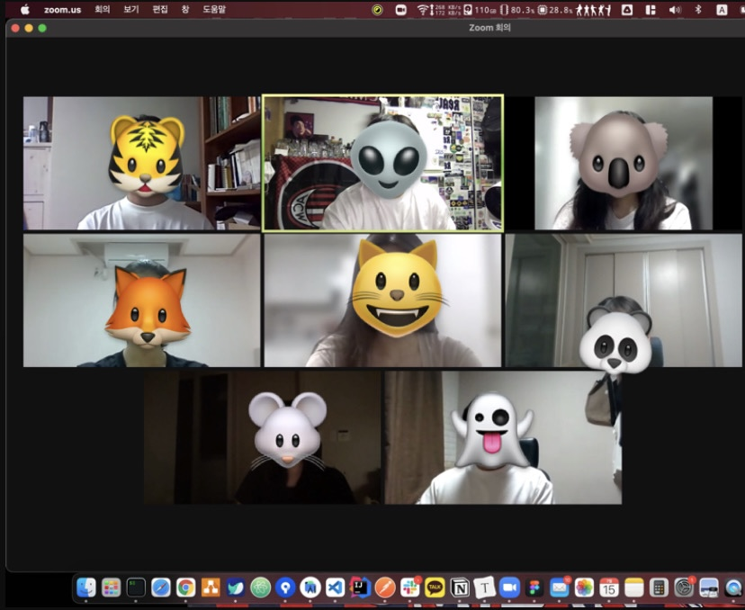

# Week 3

- :clock1:**일시** : 2021년 7월 15일 (목) 오후 8시 (약 30분 소요)
- **주제** : 개인과제 진행과 일주일간 회고
- :ok_man:**참여인원** : 김종신, 박민우, 오형석, 김민경, 김유리, 김혜인, 임주민, 장유진
- :no_good:**불참인원** : 김민정(개인 사정), 한승현(개인 사정)

 

- :memo:**내용**
  - 안드로이드 스튜디오 작업 방법에 대해서 설명 - 멘토
  - 개인들이 일주일 동안 진행해온 것들과, 어려웠던점 공유 - 멘티

 

- :camera_flash:**마무리 사진**

---

