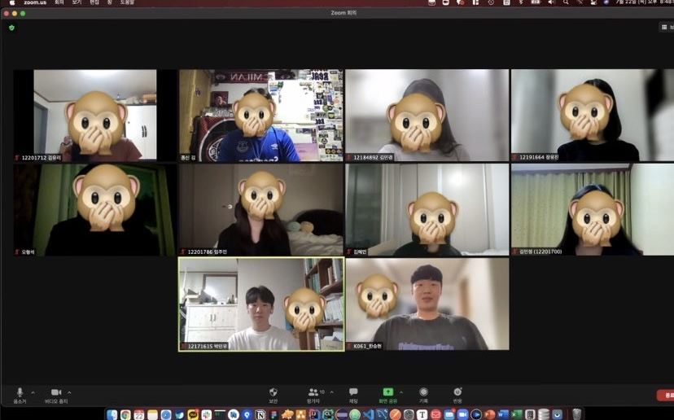

# Week 4

- :clock1:**일시** : 2021년 7월 22일 (목) 오후 8시 (약 50분 소요)
- **주제** : 개인과제 진행과 일주일간 회고
- :ok_man:**참여인원** : 김종신, 박민우, 오형석, 김민경, 김유리, 김혜인, 임주민, 장유진, 한승현, 김민정
- :no_good:**불참인원** : :x:

 

- :memo:**내용**
  - 레모네이드 앱 기본 시현, 소스코드 깃헙에 올리는 법, 새로운 PR 방식 설명
  
  - 개인들이 일주일 동안 진행해온 것들과, 어려웠던점 공유 - 멘티
  
  - ### **공통 목표 : 레모네이드 앱 구현 해보기**
  
    - **김유리**
      - 한것 : Unit-2 완료! **매일매일 하기 성공**
      - 목표 : Unit3, git, github 공부 하고 진도나가기
    - **김민경**
      - 한것 :  git 강의듣기,  unit-2 일정부분 진행
      - 목표 : 지난주 끝마치지 못한 unit-2 마무리 짓기
    - **장유진**
      - 한것 : 레모네이드 구현 시도, 기능. 구현 아직 다 못함 (컨펌 필요)
      - 목표 :  소스코드 올려서 컨펌 받고, 진도 계속해서 이어나가기
    - **오형석**
      - 한것 : Unit2 진행중 , 레모네이드 임포트 에러가 났지만 시도는 해봄
      - 목표 : 복습 다 끝내고 Unit3 들어가기
    - **임주민**
      - 한것 : Unit2 마무리 정리중
      - 목표 : 복습 진행 하기 , 진도 계속해서 하기!
    - **김혜인**
      - 한것 : Unit2 완료!
      - 목표 : Unit3 진행 하기!
    - **김민정**
      - 한것 : Unit2 진행!
      - 목표 : Unit2 끝마치기
    - **박민우** 
      - 한것 :  유닛 3 -2 끝냈지만 어려워지고 있음, 깃과 배운것들에 대한 목표
      - 목표 : 했던것 복습하며 계속 하기
    - **한승현** 
      - 한것 : **개인 사정으로 인해 진도가 많이 밀림**,  강의 밀린거 듣고, Unit 1-1 
      - 목표 : 앞으로 열심히!

 

- :camera_flash:**마무리 사진**

---

