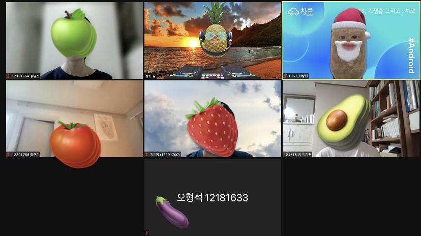

# Week 6

- :clock1:**일시** : 2021년 8월 6일 (금) 오후 9시 (멘토의 사정으로 인해, 목요일에서 금요일로 변경 됨 :cry: )
- **주제** : 개인과제 진행과 이주일간 회고
- :ok_man:**참여인원** : 김종신, 박민우, 오형석, 임주민, 장유진, 김민정, 한승현
- :no_good:**불참인원** : 김민경, 김유리, 김혜인

 

- :memo:**내용**
  - 레모네이드 앱 기본 시현, 소스코드 깃헙에 올리는 법, 새로운 PR 방식 설명

  - 개인들이 일주일 동안 진행해온 것들과, 어려웠던점 공유 - 멘티

  - ### **지난 공통 목표 : 레모네이드 앱 구현 해보기**

    - 제출 완료 인원 : 민우, 유리, 유진, 주민, 형석
    - 미제출 인원 : 민경, 민정, 승현
    - 리뷰 대기 : 혜인 (깃헙 오류로 인해 push 가 되지 않은 상태)

  - ### **새로운 공통 목표 : Unit 3 끝내고(정리까지 모두 마쳐야함) 개인 프로젝트 시작해보기**(희망인원)

  - 2주간 회고

    - **박민우**
      - 과제 진행, Unit 3 거의 끝남, 깃 기본 강의는 완료
    - **오형석**
      - 과제 진행, Unit 3-2 진행, 3-3 진행중
    - **임주민**
      - 과제 진행, Unit 3-2 , 3(정리중)
    - **장유진**
      - 과제 진행, Unit 3 완료 (정리중)
    - **김민정**
      - 과제 진행 완료 예정, Unit 2 절반완료, 차후 진행 예정
    - **한승현**
      - 과제 진행은 함 PR 못함, **Coroutine, Subject, Obejct, Observable, Subscribe** 강의 예정

---

 

- :camera_flash:**마무리 사진**

---

