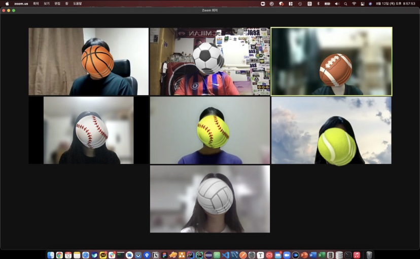

# Week 7

- :clock1:**일시** : 2021년 8월 12일 (목) 오후 8시 (멘토의 사정으로 인해, 목요일에서 금요일로 변경 됨 :cry: )
- **주제** : 개인과제 진행과 일주일간 회고
- :ok_man:**참여인원** : 김종신, 오형석, 임주민, 장유진, 김민정, 김민경, 김혜인
- :no_good:**불참인원** : 임주민, 박민우, 한승현

 

- :memo:**내용**
  - 개인들이 일주일 동안 진행해온 것들과, 어려웠던점 공유 - 멘티

  - ### **지난 공통 목표 : 레모네이드 앱 구현 해보기**

    - **<u>*모두 완료오!!!!!!!!!!!!!!!!!!!!!!!!!!!!!!!!!!!!!!*</u>**

  - ### **새로운 공통 목표 : Unit 3 끝내고(정리까지 모두 마쳐야함) 개인 프로젝트 시작해보기**(희망인원)

  - #### **Unit 2 까지 개인적으로 복습해서 올것! 못한다면, 패널티가 있거나 혹은 그에 합당한 다른 이유가 있어야 함.**

    

  - ## **멘토 : 앱 구현 시현 -> 인스타그램 시현 - DM 보내기 **

    - **박민우 (개인적으로 진행)**
      - Unit3 끝냈고 Unit3 Pathway4에 있는 프로젝트도 Unit3 폴더에 업로드해서 push 완료
        배웠던 내용들 뭔가 다시 복습도 할겸 보기좋게 카테고리별로 정리도 할겸 다시 정리해서 개인 깃허브 레포에 올려가면서 진행중
        개인 프로젝트 앱은 구상중
    - **오형석**
      - Unit 3 완료, 뭐만들지 고민중
    - **장유진**
      - Unit 3 완료, 코드 샘플 보는 중
    - **김민정**
      - Unit 2 거의 완료, **Unit 3 목표(이번주 일요일까지 할것, 못한다면 회고 때 밥이 없어요.)**
    - **김혜인**
      - Unit 3 완료, 앱 고민중 2가지에서 고민 
    - **김민경**
      - Unit 2, 레모네이드 앱, **Unit 3 목표(이번주 일요일까지 할것, 못한다면 회고 때 밥이 없어요.)**
    - **김유리**
      - 레모네이드 완료, Unit 3 -1 완료, 2 진행중, 깃 공부 위주, **22일전 까지 (못한다면 회고 때 밥이 없어요.)**

---

 

- :camera_flash:**마무리 사진**

---

