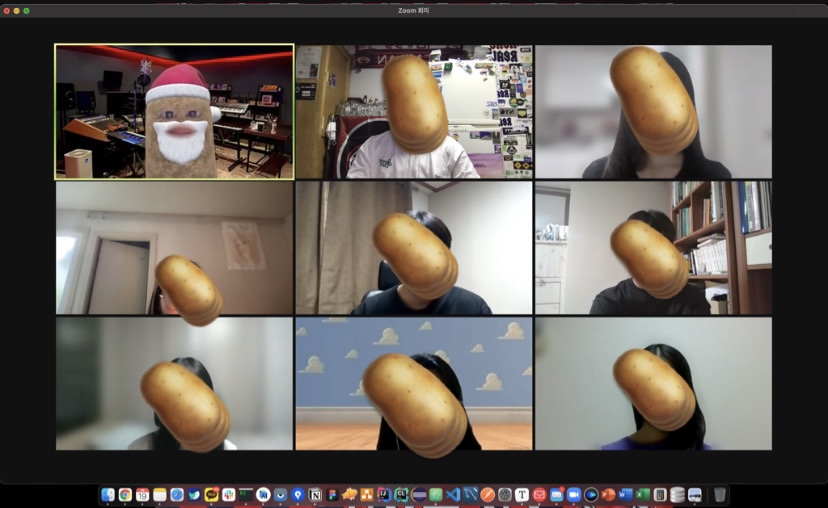

# Week 8

- :clock1:**일시** : 2021년 8월 19일 (목) 오후 8시
- **주제** : 개인과제 진행과 일주일간 회고
- :ok_man:**참여인원** : 김종신, 오형석, 임주민, 장유진, 김민정, 김민경, 김혜인, 임주민, 박민우, 한승현
- :no_good:**불참인원** : 김유리

 

- :memo:**내용**
  - 개인들이 일주일 동안 진행해온 것들과, 어려웠던점 공유 - 멘티

  - ### **Unit 3 끝내고(정리까지 모두 마쳐야함) 개인 프로젝트 시작해보기**(희망인원)

  - #### **Unit 2 까지 개인적으로 복습해서 올것! 못한다면, 패널티가 있거나 혹은 그에 합당한 다른 이유가 있어야 함.**

    - **박민우**
      - Unit 4-1 완료, **개인프로젝트 주제 고민중**
    - **오형석**
      - 깃 강의 완료, **프로젝트 주제 고민중**
    - **장유진** - (Harry porter 앱 카피)
      - 코드 이해중 
    - **김민정**
      - 다음주 전까지 Unit 3 목표 (하는중)
    - **김혜인**
      - 했던것들 복습 하는 시간, 와이어 프레임 짜는중
    - **김민경**
      - Unit 3-2 하는중, 어려워서 직접 해보는중, 다음주 전까지 Unit 3
    - **임주민**
      - Unit 3 정리중, 어려워서 그전 것들 복습
    - **한승현**
      - Unit 1 완료, Unit 2 할거고, Unit 3 할것이다. (PR 해놨고)

---

 

- :camera_flash:**마무리 사진**

---

