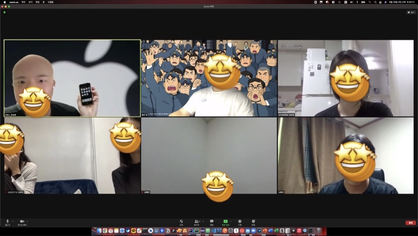

# Week 9

- :clock1: **일시** : 2021년 8월 26일 (목) 오후 8시
- **주제** : 마지막 회고 및 랜선 회식
- :ok_man: ​**참여인원** : 김종신, 오형석, 김유리, 장유진, 김민경, 김혜인, 한승현
- :no_good: ​**불참인원** : 임주민, 김민정, 박민우

 

- ## :memo: **전체 회고**

  - **박민우(멘티)**

    1. 배운 점
       1년 전에 처음으로 안드로이드 프로젝트 할 때, 공식문서가 아닌, 구글에 검색하면서 블로그 글 등을 참고해가면서 공부해서 많이 힘들었었는데 이번 기회에 공식 문서로 공부해볼 수 있어서 좋았고, 이제 나중에 기본적인 것들이 생각나지 않으면, 내가 정리했던 것들 찾아보면서 하면 될 것 같다. 나중에 찾아보기쉽게 Unit 별로 정리했던 내용 복습하면서 다시 카테고리 별로 정리해야겠다. 

       나중에 어차피 현업에서 쓰게 될 git도 공부하고, 사용해볼 수 있어서 좋았다. 다만 여러명이서 앱 개발 프로젝트를 하면서 git을 사용해볼 수 있었다면 충돌도 많이 나고, 또 해결하면서 더 많이 git을 사용하고 배울 수 있었을텐데 그런 점이 아쉽다.

       그리고 사실 안드로이드 분야로 갈지 고민하고 있었는데, 이번 썸코를 하면서 그래도 안드로이드에 대한 흥미를 많이 느껴 앞으로 본격적으로 공부해봐야겠다고 결정했다. 사실 이것만 해도 굉장히 큰 수확이라고 생각한다. 앞으로는 솝트나 부캠 같이 여러 프로젝트 경험 하면서 더 실력을 쌓아야겠다. 

    2. 아쉬운 점 
      코로나 때문에 오프라인 모임 못한점이 너무 아쉽다 ㅠ

    3. 바라는 점
    썸코가 끝나도 안드로이드 관련해서 궁금한 점 있으면 또 물어봐도 될까요 멘토님.?^^**(예 언제든지요~!)**

  - **한승현(멘티)**

    - 1학기에 솝트에서 개발을 시작하면서 처음에는 개념을 완벽히 이해하지 못한 상태로 주먹구구식으로 구현만 했고 부스트캠프를 하면서 개념이 근본이라는 사실을 깨달았습니다. 부족한 개념 공부들을 안드로이드 공식문서를 보면서 전에 비해 심도있게 공부를 할 수 있어서 좋았고 제가 급하게 공부하면서 놓쳤던 부분들을 썸머코딩을 통해 보완할 수 있어서 매우 좋았습니다. 앞으로 더 성장하여 저도 멘토처럼 지식을 공유할 수 있는 개발자로 한걸음 더 나아가고 싶습니다. 감사합니다!

  - **장유진(멘티)**

    - 땅울림 썸코 안드로이드 스터디를 들으면서 코틀린이라는 새로운 언어를 알게 되었고, 안드로이드 개발을 처음 해 보았습니다.
      사실 개발에 큰 관심은 없었는데 스터디를 들으면서 안드로이드 개발이 조금 많이 어렵긴 했으나 재밌었고, 신기했습니다!! 온라인으로 스터디가 진행된것이 너무너무 아쉬웠으나 재미있는 스터디였습니다ㅎㅎ 감사합니다!!

  - **김민정(멘티)**

    - 안드로이드 스튜디오를쓰려다 낭패를 본 경험이 있어서, 모바일 앱을 제작한다는 것에 대한 두려움이 있었습니다. 그러나 이번 '2021땅울림 썸머코딩-안드로이드' 스터디에서 두려움에서의 해방감을 느낄 수 있었습니다!

      먼저, 언어를 차근차근 배워나가며 실습을 하는 과정이 이론으로만 이해하기에는 어려운 부분들을 해소시켜줄 수 있는 커리큘럼이 굉장히 효율적이며 실력 향상에 도움이 된다고 느꼈습니다.
      또한, 막히는 부분이 있다면 지속적으로 멘토님과 소통을 하며 해결할 수 있었던 점이 정말 좋았습니다. 안드로이드 스튜디오와 같은 수업에서 알려주지 않은 문제점들이 발생했을 때 해결할 수 있는 도움을 받을 수 있었습니다!

      코틀린이 무엇인지도 몰랐던 제가 코틀린을 활용하여 간단한 앱을 만들 수 있는 능력을 키울 수 있었던 보람찬! 방학이었습니다 :)

  - **김혜인(멘티)**

    - 작년 안드로이드 썸머코딩땐 기초지식을 배우고 하기보단 처음부터 앱을 만들면서 배웠어서 앱을 만드는데 난황을 겪었는데 이번엔 차근차근 심도있게 배울 수 있어서 추후에도 유용하게 쓸 수 있는 지식으로 남을 것 같습니다! 감사합니다! 아쉬운점은 딱히 없었습니다! 다만 오류가 날 때는 해결하기가 힘든데, 그때 최대한 구글을 사용해보겠지만 가끔 해결이 안될때는 연락을 드려도 될까요?! **(언제든지 연락주세요~!)**

  - **김민경(멘티)**

    - 안드로이드 kotlin 개발 3주차까지 완료하고 git에 대해 학습했습니다. 어플리케이션을 스스로 개발해 볼 일이 없었는데 일주일에 한 번의 회고를 통해 나름 정기적으로 꾸준한 학습을 이어갈 수 있는 기회가 생겨 좋았습니다. 추후 추가 학습을 통해 한 학기 동안 어플리케이션 개발을 이어나가 볼 생각입니다. 특별히 아쉬운 점은 없었습니다. 대면으로 진행했으면 더 좋았을텐데 하는 상황적 아쉬움은 있습니다. 

      방학동안 고생하셨습니다, 멘토님. 이후에도 궁금한 점 생기면 여쭤봐도 될까요?! 이것저것 가르쳐주신 점 감사합니다!! **(질문은 언제든지!)**

  - **임주민(멘티)**

    - 앱개발을 배우고 싶었는데 이번에 썸머코딩을 통해서 안드로이드를 배우게 되서 너무 좋은 경험이었습니다! 안드로이드 스튜디오, 코틀린 처음 경험해봐서 생소해서 어려웠지만 한 번 배워보니 나중에 다시 쓸 기회가 있다면 정말 도움될 것 같아요. 스터디 중간에 Unit3 배우는 과정에서 막혀서 공부를 게을리 하게 돼서 진도를 결국 조금 나간 것이 아쉬운 것 같습니다ㅎㅎ 앱개발은 코드뿐만이 아니라 관리 할 것들이 정말 많다는 것을 알게되었어요. 다음에는 ios를 배워서 제 폰으로 사용할 수 있는 어플을 만들고 싶습니다ㅎㅎㅎ 덕분에 깃, 소스트리도 경험해보게 되었어요 정말로 감사합니다! 스터디 잘 이끌어주셔서 너무 감사해요..!

  - **김유리(멘티)**

    - 첨엔 열심히 하겠다고 다짐하고서 일주일에 한 Unit을 끝내려고 했지만 저의 의지가 부족했던 탓에 Unit3를 마지막으로 썸코가 끝나서 너무 아쉽습니다ㅠㅠ 그래도 해보고싶다는 생각만 해보고 안 해본 Kotlin뿐만 아니라 git공부도 해보고 github사용법도 익힐 수 있어서 정말 유익했던 거 같아요!! 앱등이라 그런지 안드로이드는 저랑 안맞는 거 같기도 하고 그렇네요😅 약 2달동안 매주 스터디 해주셔서 정말 감사드려요ㅎㅎ

  - **오형석(멘티)**

    - Android Basics in Kotlin 코스를 Unit 3까지 진행하면서 Kotlin을 처음 접해볼 수 있었고 Android 개발이란 어떤것인지 경험해볼 수 있었습니다. 방학을 너무 즐기는 바람에 개인 프로젝트까지는 진행해보지 못한 아쉬움이 남아있지만 생활코딩 GIt 강의도 보고 스터디 진행하며 Sourcetree도 사용해봤기에  Git에 대한 지식도 얻어 충분히 유의미한 방학을 보냈다고 생각합니다. 이제 어떤 분야를 공부할지 정해야 될 때라 생각하고 있었는데 땅울림 여름코딩 Android 스터디를 하며 앱개발쪽을 공부해봐야겠다는 생각을 가지게되었습니다. 감사합니다!

  - **김종신(멘토)**

    1. **배운 부분과 놓친 부분**

       생각 보다 많은 멘티들이 들어와서 처음에는 당황 했으며, 전반적인 강의를 구글에서 제공하는 부분으로 진행하려다 보니 놓친 부분이 많았다, 또한 개인적인 준비를 충분히 했으면 좋았겠지만 그렇지 못해서 멘티들에게 미안한 부분이 많다.
       개인적인 질문을 받는다고 받아 줬지만 가려웠던 부분들을 시원하게 긁어주지 못한것 같아서 미안했다.

       **불편했을 텐데 적극적으로 질문해주어서 다시한번 고맙다.**

       **방학인데도 불구하고 멘티들이 열심히 잘 따라와주고, 하려하는 모습에서 많이 배우게 되었다.**

    2. **아쉬웠던 부분**

       코로나로 인하여 전부 비대면으로 진행 된 부분이 많이 아쉽다. 

       처음의 썸머코딩을 시작했을 때의 목표보다 아직 보여주지 못하고 해주지 못한게 많아서 아쉬움으로 남는다. (다음에는(?) 좀 더 철저하게)

       개인적인 일들로 신경을 많이 써주지 못했으며, 준비를 제대로 하지 못해 실시간 코딩으로 구현해주기로 했던 부분에 있어서 제대로 보여주지 못해서 미안합니다ㅠ

       차차 코로나 상황이 나아지리라 생각했지만 그러지 못하여 마지막 까지 비대면으로 진행하게 되어 ...(회식 안녕 .. 😩)

    3. **전체 회고**

       처음에 욕심내서 목표했던 것들 보다 약간의 목표치가 적어졌지만 다들 잘 따라와줘서 너무나 고마웠습니다.

       다음에 이런 기회가 다시 온다면 조금 더 준비를 하고, 각 인원들을 신경 써줄 수 있도록 노력할게요.

       아직 부족한게 많은 멘토이지만 잘 따라와준 멘티들에게 너무나도 고맙고, 방학 동안 귀한 시간 내어서 함께 해줘서 고맙습니다.

       2학기에 추가적으로 개인적인 앱을 만들기로한 멘티들은 저와 함께 알차게(?) 보냅시다 ㅎㅎ 

       그동안 고생많았어요~!!

       

---

 

- ## :camera_flash:**마무리 사진**

---

